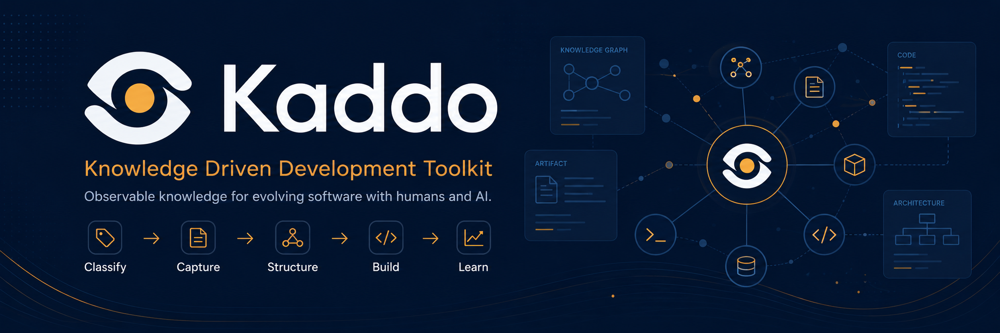

<p align="center">
  
</p>

# Kaddo — Knowledge Driven Development

> **Prepare any codebase for AI-assisted evolution.**
> Kaddo helps your repo remember why the code exists.

Kaddo is an open-source **CLI and agent prompt toolkit** that helps new, pre-AI and legacy
projects build a living knowledge layer close to the code. The CLI prepares and structures the
context; your LLM agents turn it into product understanding.

## What is Kaddo?

A practical toolkit for **Knowledge Driven Development (KDD)**. It scans your repo, prepares
context for your LLM, guides agent-based understanding, turns roadmap candidates into Work
Items, declares ownership and warns when code changes may leave knowledge behind.

It works in two layers:

- **The CLI** does the deterministic work — no AI, no API key.
- **Your LLM** does the interpretation — using Kaddo agents in your chat (Claude, ChatGPT,
  Cursor, Copilot, Windsurf…).

> Kaddo does not try to make the CLI "understand everything". The CLI collects and structures
> signals. The LLM agents turn those signals into product understanding.

## Why Kaddo?

**Your code changes. Your project knowledge often does not.**

Projects degrade because knowledge is scattered across meetings, chats, tickets and outdated
docs. With AI, this gets worse: agents build on assumptions when they lack context. Kaddo
keeps the minimum necessary context alive next to the code — without turning development into
bureaucracy.

## Install

```bash
npx @trycatch.tv/kaddo init
# or
npm install -g @trycatch.tv/kaddo && kaddo --help
```

## Full workflow

```bash
kaddo init                   # state: new | pre-ai | legacy, team size, structure
kaddo scan                   # deterministic technical inventory → .kaddo/scan.json
kaddo context                # LLM context pack → .kaddo/context-pack.md
kaddo add agents             # install agent prompt packs
kaddo understand             # guided CLI → LLM handoff plan
# ── use your LLM with the context pack + agents to create
#    capabilities, architecture and a roadmap ──
kaddo create --from roadmap  # turn a roadmap candidate into a Work Item
kaddo owners suggest         # declare code: ownership on the Work Item
kaddo guard                  # detect possible knowledge drift
kaddo explain                # summarize what Kaddo currently knows
```

The loop in one sentence: **scan the repo → prepare context → use agents in your LLM → create
roadmap-driven work items → connect knowledge to code → guard against drift → explain the
state.**

## Choose your use case

Pick the guide closest to your situation:

- [**New project**](https://kaddo.trycatch.tv/use-cases/new-project/) — start with structured knowledge from day one.
- [**Pre-AI project**](https://kaddo.trycatch.tv/use-cases/pre-ai-project/) — prepare an existing repo for humans and LLM agents.
- [**Legacy project**](https://kaddo.trycatch.tv/use-cases/legacy-project/) — understand before changing risky systems.
- [**Full workflow**](https://kaddo.trycatch.tv/use-cases/full-workflow/) — the complete loop with expected artifacts.
- [**Project scope**](https://kaddo.trycatch.tv/project-scope/) — exactly what Kaddo does and does not do.

## Playbook

How to actually operate Kaddo with prompts, traceability and team collaboration:

- [**Concepts**](https://kaddo.trycatch.tv/playbook/concepts/) — Work Item, Knowledge Level, Context Pack, Ownership, Knowledge Drift and more.
- [**Prompt Workflow**](https://kaddo.trycatch.tv/playbook/prompt-workflow/) — CLI input → prompt/agent → expected output → where to save it.
- [**Work Item Traceability**](https://kaddo.trycatch.tv/playbook/work-item-traceability/) — roadmap → work item → ownership → guard → learning.
- [**Examples with Other Tools**](https://kaddo.trycatch.tv/playbook/tool-examples/) — GitHub Issues, Jira/Linear, OpenSpec, agent frameworks, LLM chats.
- [**Collaboration Guide**](https://kaddo.trycatch.tv/playbook/collaboration/) — governance by exception, roles and a lightweight PR checklist.

## New vs Pre-AI vs Legacy

| Project state | What Kaddo does |
|---|---|
| **new** | Start with a minimal knowledge structure (roadmap, work items, minimum context) without process overhead. |
| **pre-AI** | Scan the repo, prepare a context pack and understand it with agents before evolving. |
| **legacy** | Map ownership gradually and identify risky areas before changing code. |

## CLI vs LLM agents

| Layer | Responsibility |
|---|---|
| **Kaddo CLI (deterministic)** | init, scan, context, add agents, understand handoff, create, owners, guard, explain |
| **LLM chat (interpretation)** | extract capabilities, reconstruct architecture, propose roadmap, identify risks, draft artifacts |

**Kaddo does not** call an LLM by default, require API keys, generate code automatically,
replace human review, or replace Jira / Linear / GitHub Issues.

## Commands

| Command | What it does |
|---|---|
| `kaddo init` | Initialize Kaddo in the current project |
| `kaddo scan` | Detect stack and suggest domains; writes `.kaddo/scan.json` + `architecture/inventory.md` |
| `kaddo context` | Generate an LLM context pack for agent handoff |
| `kaddo add agents` | Install agent prompt packs |
| `kaddo understand` | Guide the CLI → LLM handoff with a state-aware agent plan |
| `kaddo create [--from roadmap]` | Create a Work Item (feature, bugfix, hotfix, spike) |
| `kaddo owners [suggest]` | List domain owners, or declare `code:` ownership on artifacts |
| `kaddo guard` | Detect when modified code has related artifacts that were not updated |
| `kaddo explain` | Summarize what Kaddo currently knows about the project |

Supporting commands: `kaddo status`, `kaddo learn`, `kaddo classify`, `kaddo history`,
`kaddo module`, `kaddo modules map|list`, `kaddo add <module>`.

## Multirepo modules & global artifacts

Map secondary repositories as living modules of one system from the architecture repo:

```bash
kaddo modules map    # register a secondary repo (frontend/backend/infra…) as a module
kaddo modules list   # list mapped modules
```

This records the module in `.kaddo/modules.yml` and generates a per-module knowledge
structure under `architecture/modules/<id>/` (`module-design.md`, `stack.md`,
`security.md`, `standards.md`, `diagrams/`, `adrs/`). Existing files are never
overwritten.

Install **global** artifacts for the whole system on demand:

```bash
kaddo add standards    # architecture/standards.md
kaddo add security     # architecture/security.md  (documents concerns — no scanning)
kaddo add stack        # architecture/stack.md
kaddo add git-strategy # architecture/git-strategy.md + .kaddo/git.yml
```

Git strategy default is **GitHub Flow + Conventional Commits + SemVer**, customizable
via `.kaddo/git.yml` — Kaddo recommends, it does not enforce. Six **operational agents**
(`work-item`, `git-strategy`, `security`, `standards`, `stack`, `module-design`) ship with
`kaddo add agents` to refine these artifacts in your LLM. Kaddo never scans repos, calls a
Git/GitHub API, or runs a security scan.

## Templates

Kaddo ships templates for its main artifacts — Work Items, roadmaps, capabilities,
architecture baselines, ADRs, multirepo modules, security, standards, stack, Git
strategy, incidents, runbooks and legacy risks/unknowns/modernization candidates. They
live in a central registry (`packages/cli/src/templates/registry.ts`) and are organized
into five categories: **core**, **architecture**, **module**, **operations** and
**legacy**.

Templates are designed to capture **minimum sufficient knowledge** without creating
documentation theater — they are guides, not mandatory forms. Each carries a purpose,
when-to-use, output path, related command/agent and a quality checklist. See the
[Templates docs](https://kaddo.trycatch.tv/templates/overview/).

## Examples

The [`examples/`](examples/) folder has reproducible demo repositories — open one and see
how Kaddo turns a project into operative knowledge, with committed `.kaddo/` and
`architecture/` artifacts so you can inspect the output without running anything:

| Example | Scenario | State | Highlights |
|---|---|---|---|
| [Task Pilot](examples/new-project/) | Greenfield app | `new` | Structured knowledge from day one; full loop |
| [Loyalty Lite](examples/pre-ai-project/) | Existing app | `pre-ai` | `scan` + agents + Guard drift demo |
| [Old Orders](examples/legacy-project/) | Legacy MVC app | `legacy` | Understand-before-change; legacy risks/unknowns |
| [Commerce Stack](examples/multirepo-workspace/) | Many repos | `multirepo` | `modules map` + per-module artifacts |

Each example also ships a `prompt-flow.md` — a Mermaid diagram, the CLI↔LLM split, an
input/output table and copy/paste prompt handoffs — so you can reproduce the full loop
without guessing which prompt to use. CLI artifacts are exactly what `kaddo` writes;
agent outputs are clearly marked as illustrative. See the
[Examples docs](https://kaddo.trycatch.tv/examples/).

## How ownership and Guard work

Ownership is declared in the front matter of each artifact — no central mapping file:

```yaml
---
type: feature
id: WI-001
title: "Add payment retry logic"
status: in-progress
code:
  - src/payments/**
  - src/shared/payment/**
---
```

Guard Lite reads `git diff`, finds artifacts whose `code:` globs match the changed files, and
shows a **non-blocking FYI** when the artifact was not updated in the same diff:

```
  ⚠ Possible knowledge drift: WI-001 (feature, K2)
    Changed code matching this artifact:
      - src/payments/payments.service.ts
    WI-001 was not updated in this diff.
```

Guard is **silent** when no artifacts declare ownership — no noise on day one. Run
`kaddo owners suggest` to declare globs without editing YAML by hand.

## What Kaddo does not do

- Not a code generator
- Not an agent execution framework (it ships agent *prompts*, it does not run them)
- Not a replacement for Jira, Linear or documentation tools
- Not a platform
- Does not call an LLM or require an API key

## Roadmap

| Version | What shipped |
|---|---|
| v1.0 | `init`, `scan`, `create`, `guard` (Guard Lite) |
| v1.1 | `explain`, `status`, `learn`, Evidence Score |
| v1.2 | `classify` (Classification Drift), `history` |
| v1.4 | `guard --ci` (JSON output for CI/PR) |
| v2.0 | Optional module system (`kaddo add`) |
| v2.1 | Semantic plugins: `prisma`, `openapi` |
| v2.2 | Domain Owners (`kaddo owners`) |
| v2.3 | Multirepo Module Descriptor (`kaddo module`) |
| v2.4–2.5 | Modules: `contracts`, `capabilities`, `guard-advanced`, `agents`, `skills` |
| v2.6 | Knowledge loop: `context`, `understand`, `add agents`, roadmap output, `create --from roadmap`, Guard Lite end-to-end, `owners suggest`, project `explain` |
| v2.6 | Multirepo modules (`modules map/list`), global standards/security/stack/git-strategy artifacts, six operational agents |
| v2.6 | Central template registry (23 templates, five categories) |
| v2.6 | Demo example repositories (`examples/`): new, pre-AI, legacy, multirepo |

**Optional modules (installed with `kaddo add`):**
`adr` · `rfc` · `incident` · `migration` · `legacy` · `contracts` · `capabilities` ·
`guard-advanced` · `agents` · `skills` · `standards` · `security` · `stack` · `git-strategy`

## Contributing

See [CONTRIBUTING.md](CONTRIBUTING.md).

## License

MIT
