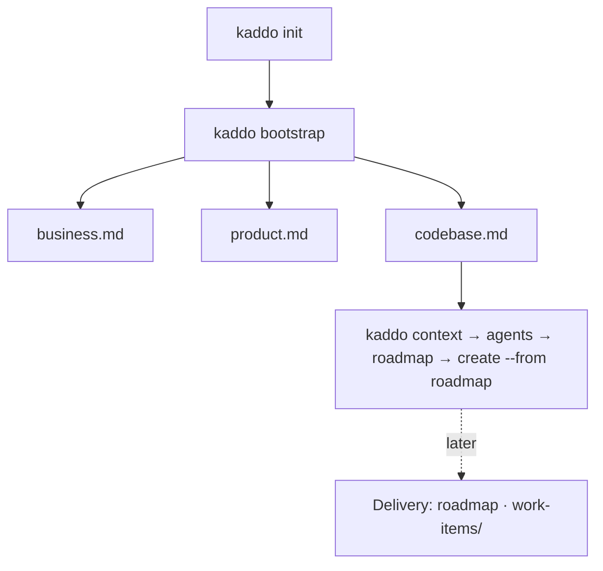

```bash
kaddo bootstrap
```

For **new projects**, `kaddo bootstrap` turns an initial idea into structured knowledge
**before** you write code. It scaffolds the **minimal** base of the project's four macro
layers from the template registry:

```txt
Business → Product → Tech → Delivery
```

`bootstrap` is deterministic: it never calls an LLM, never generates source code, and
never decides the architecture. It creates **starter artifacts** (with `TBD`, assumptions
and open questions) that you then refine with the bootstrap agents in your own LLM. It
generates only the minimal base — **Delivery** (roadmap, work items) and **decisions**
emerge later, through agents and real work.

## The macro layers



## What it generates — minimum sufficient knowledge

Exactly **one consolidated file per layer**, with the sections inside:

| Layer | File | Sections |
|---|---|---|
| **Business** | `knowledge/business/business.md` | Problem · Users · Value Proposition · Business Rules · Constraints |
| **Product** | `knowledge/product/product.md` | Product Brief · Capabilities · Scope · Out of Scope · Success Criteria |
| **Tech** | `knowledge/tech/codebase.md` | Repository Structure · Candidate Stack · Quality Attributes · Standards · Git Strategy · Initial Modules |

That is **all** bootstrap creates. It does **not** generate specialized files
(`problem.md`, `users.md`, `capabilities.md`, …), `knowledge/delivery/` or
`knowledge/tech/decisions/`. As the project matures, `business.md` can split into
`problem.md`, `users.md`, … and `product.md` into `product-brief.md`, `capabilities.md` —
those specialized templates stay in the registry as **advanced** templates. Knowledge
grows progressively; you are never forced to start with everything.

**Consolidated artifacts are valid knowledge.** Kaddo recognizes `business.md`,
`product.md` and `codebase.md` by their front-matter `type`, so `explain`/`understand`
report them as real knowledge (status *Consolidated*) — not as "missing".

## Behavior

- Requires `kaddo init` first (otherwise: `Run 'kaddo init' first.`).
- Oriented to `state: new`. On `pre-ai`/`legacy` it warns and asks for confirmation.
- **Never overwrites** existing artifacts — they are reported as skipped.
- All artifacts come from the central template registry.

## Next steps

```bash
kaddo context        # prepare the LLM context pack
kaddo add agents     # installs business-agent, bootstrap-agent, codebase-agent
kaddo understand     # guided handoff
# refine the artifacts in your LLM, then:
kaddo create --from roadmap
```

The three bootstrap agents — `business-agent`, `bootstrap-agent` and
`codebase-agent` — turn these starter artifacts into real definition. Kaddo
prepares structure; your LLM and your team provide the content. Kaddo never invents
business facts and never writes code.
