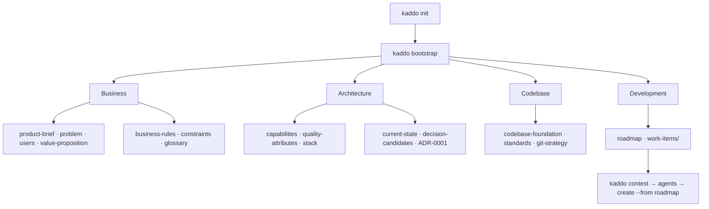

```bash
kaddo bootstrap
```

For **new projects**, `kaddo bootstrap` turns an initial idea into structured knowledge
**before** you write code. It scaffolds knowledge artifacts from the template registry
across Kaddo's four base layers:

```txt
Business → Architecture → Codebase → Development
```

`bootstrap` is deterministic: it never calls an LLM, never generates source code, and
never decides the architecture. It creates **starter artifacts** (with `TBD`, assumptions
and open questions) that you then refine with the bootstrap agents in your own LLM.

## The four layers



## What it generates

| Layer | Artifacts |
|---|---|
| **Business** | `architecture/business/{product-brief, problem, users, value-proposition, business-rules, constraints, glossary}.md` |
| **Architecture** | `architecture/{capabilities, quality-attributes, stack, current-state, decision-candidates}.md` + `architecture/adrs/ADR-0001-initial-architecture.md` |
| **Codebase** | `architecture/{codebase-foundation, standards, git-strategy}.md` |
| **Development** | `architecture/roadmap.md` + `architecture/work-items/` |

Plus `architecture/bootstrap-summary.md` — an index of what was created and the next step.

## Behavior

- Requires `kaddo init` first (otherwise: `Run 'kaddo init' first.`).
- Oriented to `state: new`. On `pre-ai`/`legacy` it warns and asks for confirmation.
- **Never overwrites** existing artifacts — they are reported as skipped.
- All artifacts come from the central template registry.

## Next steps

```bash
kaddo context        # prepare the LLM context pack
kaddo add agents     # installs business-agent, bootstrap-agent, codebase-foundation-agent
kaddo understand     # guided handoff
# refine the artifacts in your LLM, then:
kaddo create --from roadmap
```

The three bootstrap agents — `business-agent`, `bootstrap-agent` and
`codebase-foundation-agent` — turn these starter artifacts into real definition. Kaddo
prepares structure; your LLM and your team provide the content. Kaddo never invents
business facts and never writes code.
