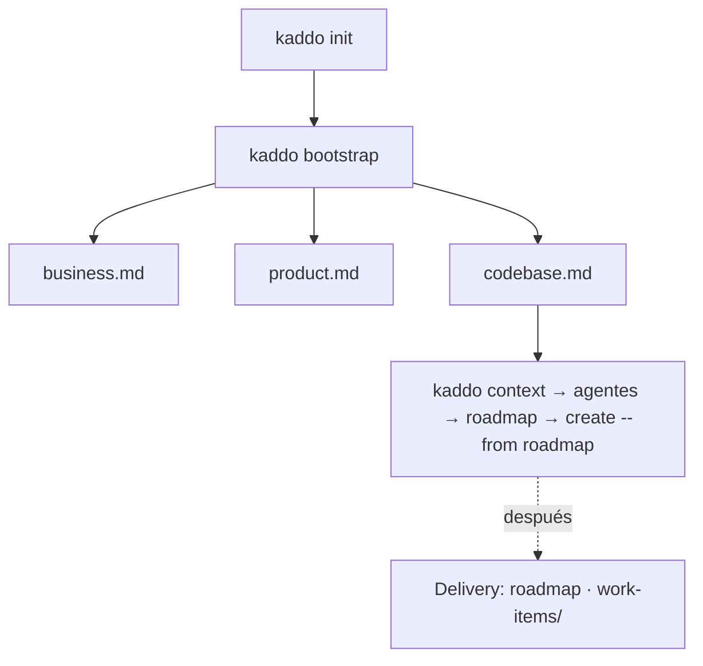

```bash
kaddo bootstrap
```

Para **proyectos nuevos**, `kaddo bootstrap` convierte una idea inicial en conocimiento
estructurado **antes** de escribir código. Genera la base **mínima** de las cuatro capas
macro del proyecto desde el template registry:

```txt
Business → Product → Tech → Delivery
```

`bootstrap` es determinístico: nunca llama a un LLM, nunca genera código fuente y nunca
decide la arquitectura. Crea **artefactos iniciales** (con `TBD`, supuestos y preguntas
abiertas) que luego refinas con los agentes de bootstrap en tu propio LLM. Genera solo la
base mínima — **Delivery** (roadmap, work items) y las **decisiones** emergen después, vía
agentes y trabajo real.

## Las capas macro



## Qué genera — conocimiento mínimo suficiente

Exactamente **un archivo consolidado por capa**, con las secciones dentro:

| Capa | Archivo | Secciones |
|---|---|---|
| **Business** | `knowledge/business/business.md` | Problem · Users · Value Proposition · Business Rules · Constraints |
| **Product** | `knowledge/product/product.md` | Product Brief · Capabilities · Scope · Out of Scope · Success Criteria |
| **Tech** | `knowledge/tech/codebase.md` | Repository Structure · Candidate Stack · Quality Attributes · Standards · Git Strategy · Initial Modules |

Eso es **todo** lo que crea bootstrap. **No** genera archivos especializados
(`problem.md`, `users.md`, `capabilities.md`, …), ni `knowledge/delivery/` ni
`knowledge/tech/decisions/`. A medida que el proyecto madura, `business.md` puede dividirse
en `problem.md`, `users.md`, … y `product.md` en `product-brief.md`, `capabilities.md` —
esos templates especializados quedan en el registry como templates **avanzados**. El
conocimiento crece progresivamente; nunca estás obligado a empezar con todo.

## Comportamiento

- Requiere `kaddo init` primero (si no: `Run 'kaddo init' first.`).
- Orientado a `state: new`. En `pre-ai`/`legacy` avisa y pide confirmación.
- **Nunca sobrescribe** artefactos existentes — se reportan como skipped.
- Todos los artefactos vienen del template registry central.

## Siguientes pasos

```bash
kaddo context        # prepara el context pack para el LLM
kaddo add agents     # instala business-agent, bootstrap-agent, codebase-agent
kaddo understand     # handoff guiado
# refina los artefactos en tu LLM, luego:
kaddo create --from roadmap
```

Los tres agentes de bootstrap — `business-agent`, `bootstrap-agent` y
`codebase-agent` — convierten estos artefactos iniciales en definición real.
Kaddo prepara la estructura; tu LLM y tu equipo aportan el contenido. Kaddo nunca inventa
hechos de negocio ni escribe código.
