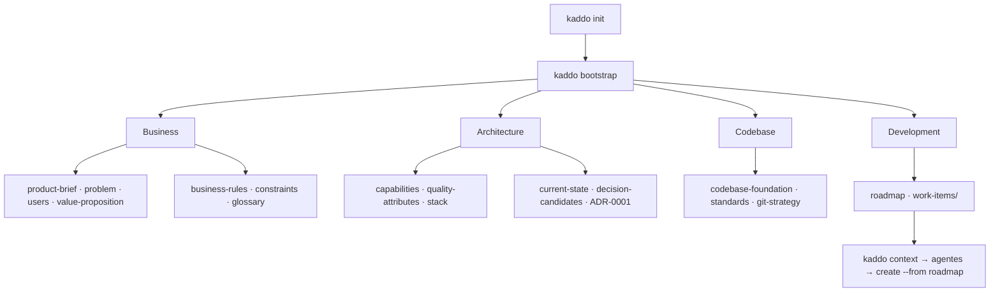

```bash
kaddo bootstrap
```

Para **proyectos nuevos**, `kaddo bootstrap` convierte una idea inicial en conocimiento
estructurado **antes** de escribir código. Genera artefactos de conocimiento desde el
template registry a lo largo de las cuatro capas base de Kaddo:

```txt
Business → Architecture → Codebase → Development
```

`bootstrap` es determinístico: nunca llama a un LLM, nunca genera código fuente y nunca
decide la arquitectura. Crea **artefactos iniciales** (con `TBD`, supuestos y preguntas
abiertas) que luego refinas con los agentes de bootstrap en tu propio LLM.

## Las cuatro capas



## Qué genera

| Capa | Artefactos |
|---|---|
| **Business** | `architecture/business/{product-brief, problem, users, value-proposition, business-rules, constraints, glossary}.md` |
| **Architecture** | `architecture/{capabilities, quality-attributes, stack, current-state, decision-candidates}.md` + `architecture/adrs/ADR-0001-initial-architecture.md` |
| **Codebase** | `architecture/{codebase-foundation, standards, git-strategy}.md` |
| **Development** | `architecture/roadmap.md` + `architecture/work-items/` |

Más `architecture/bootstrap-summary.md` — un índice de lo creado y el siguiente paso.

## Comportamiento

- Requiere `kaddo init` primero (si no: `Run 'kaddo init' first.`).
- Orientado a `state: new`. En `pre-ai`/`legacy` avisa y pide confirmación.
- **Nunca sobrescribe** artefactos existentes — se reportan como skipped.
- Todos los artefactos vienen del template registry central.

## Siguientes pasos

```bash
kaddo context        # prepara el context pack para el LLM
kaddo add agents     # instala business-agent, bootstrap-agent, codebase-foundation-agent
kaddo understand     # handoff guiado
# refina los artefactos en tu LLM, luego:
kaddo create --from roadmap
```

Los tres agentes de bootstrap — `business-agent`, `bootstrap-agent` y
`codebase-foundation-agent` — convierten estos artefactos iniciales en definición real.
Kaddo prepara la estructura; tu LLM y tu equipo aportan el contenido. Kaddo nunca inventa
hechos de negocio ni escribe código.
