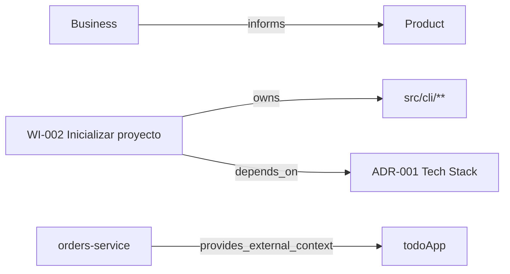

Kaddo ya captura conocimiento conectado — Markdown, front matter, Work Items, ADRs, roadmap,
ownership y Knowledge Capsules. Pero esas conexiones suelen ser **implícitas**. `kaddo graph
export` las hace explícitas en archivos simples, versionables y fáciles de revisar.

```bash
kaddo graph export        # → .kaddo/graph.json + .kaddo/graph.mmd
```

> **No necesitas una base de grafos para empezar a pensar en grafos.** Kaddo exporta el grafo que
> ya existe de forma implícita en tus archivos — nada más.

## Qué es

Un **grafo de conocimiento liviano basado en archivos**, construido de forma determinista a partir
de artefactos que ya tienes:

```text
Markdown + Front matter + IDs + Globs + Capsules + Roadmap + Work Items
        ↓  kaddo graph export
                graph.json + graph.mmd
        ↓
Onboarding · Análisis de impacto · Selección de contexto · Explicación de Guard
```

Te ayuda a responder, rápido:

- ¿Qué capability se conecta con este Work Item?
- ¿Qué ADR justifica este módulo?
- ¿Qué rutas de código se relacionan con este cambio?
- ¿Qué conocimiento externo aplica a esta integración?
- ¿Qué artefactos podrían quedar desactualizados si cambio esta carpeta?

## Qué **no** es

No es una base de grafos ni una plataforma visual. Kaddo **no** lee tu `src/`, no interpreta
código fuente, no llama a un LLM, no infiere relaciones semánticas, no crea una base de grafos, no
genera un portal web, no usa RAG, embeddings ni una vector database, y no sincroniza en tiempo
real. Solo exporta las relaciones que ya están declaradas en tu conocimiento.

Es lo opuesto a RAG: RAG recupera fragmentos de texto por similitud; este grafo exporta la
**estructura explícita y declarada** de tu proyecto — sin modelo, sin vectores, totalmente
determinista.

## Salidas

| Archivo | Formato | Para qué |
|---|---|---|
| `.kaddo/graph.json` | JSON | herramientas, tests, debugging, integraciones futuras |
| `.kaddo/graph.mmd` | Mermaid | visualización rápida en GitHub, Markdown, docs, presentaciones |

```bash
kaddo graph export --format json      # solo JSON
kaddo graph export --format mermaid   # solo Mermaid
```

## Alcance

```bash
kaddo graph export --scope active   # por defecto — Work Items activos + relaciones cercanas
kaddo graph export --scope all      # todos los artefactos soportados (puede ser grande)
```

- **active** (por defecto): solo Work Items activos (`draft`, `ready`, `in-progress`, `blocked`) y
  sus nodos directamente relacionados (code globs, capabilities, ADRs de los que dependen,
  initiative, candidato de roadmap). La cadena de capas de conocimiento y las Knowledge Capsules
  siempre se incluyen.
- **all**: el grafo completo, incluyendo Work Items completados/archivados y todos los ADRs en
  `knowledge/tech/decisions/` (incluso los no referenciados).

`active` es el valor por defecto para mantener los diagramas legibles.

## Nodos y relaciones

Los nodos vienen de los artefactos de conocimiento; las relaciones vienen del front matter y de
las relaciones conocidas entre capas.

| Relación | De → A | Origen |
|---|---|---|
| `informs` | capa → siguiente capa | `business → product → tech → delivery` |
| `owns` | Work Item → code glob | `code:` del Work Item |
| `implements` | Work Item → capability | `capabilities:` del Work Item |
| `depends_on` | Work Item → ADR | `decisions:` del Work Item |
| `governs` | ADR → code glob | `code:` del ADR |
| `belongs_to` | Work Item → initiative | `initiative` / `source_initiative` |
| `materialized_as` | candidato de roadmap → Work Item | `source: roadmap` + `source_id` |
| `provides_external_context` | Knowledge Capsule → proyecto | `.kaddo/external.yml` |

## Cómo leer el Mermaid

`graph.mmd` es un `flowchart LR` estándar de Mermaid. GitHub, muchos visores de Markdown y
Docusaurus lo renderizan directamente. Pégalo en un bloque ```mermaid, o ábrelo con cualquier
editor Mermaid en vivo.



Cada flecha es una relación declarada — síguelas para ver qué depende de qué.

## Mejorar la calidad del grafo

Si la exportación reporta **relaciones limitadas**, el grafo solo tiene la cadena de capas o nodos
aislados. Enriquece tu front matter para que Kaddo pueda conectar más:

```yaml
---
id: WI-002
type: feature
capabilities:
  - task-management
decisions:
  - ADR-001
code:
  - src/cli/**
source: roadmap
source_id: WI-CANDIDATE-001
---
```

## Cómo mejora el contexto

El grafo nunca infla tu context pack. Tras exportarlo, `kaddo context` y `kaddo explain` muestran
un **resumen** breve (no el grafo completo):

```text
Knowledge Graph:
- Available: yes
- Nodes: 18
- Edges: 24
- Active Work Items connected to code: 2
```

El grafo completo vive en los archivos exportados. Kaddo **nunca genera el grafo
automáticamente** — corre `kaddo graph export` cuando quieras actualizarlo.

## Seguridad

El grafo contiene solo rutas, IDs de artefactos, labels, owners, resúmenes y relaciones. **Nunca**
debe incluir secretos, tokens, contraseñas, llaves privadas, valores de entorno, contenido de
código fuente ni PII — y como Kaddo nunca lee `src/`, no puede filtrar código.

## Ver también

- [Knowledge Capsules](/es/knowledge-capsules/) — compartir conocimiento entre repositorios.
- [Eficiencia de contexto](/es/token-efficiency/) — por qué el conocimiento estructurado supera a
  la re-exploración.
- [Momentos de operación](/es/operating-moments/) — dónde encaja el grafo en el flujo.
