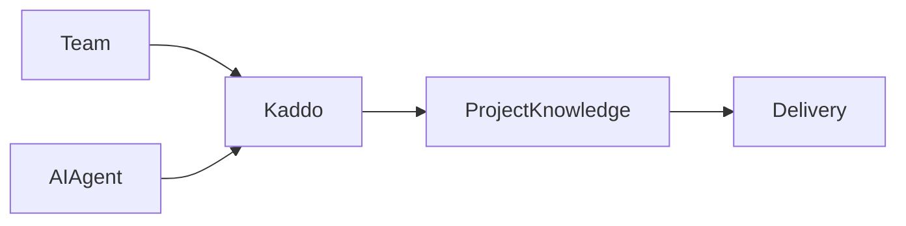

El conocimiento de Business, Product y Tech se escribe en Markdown. Parte del conocimiento se entiende
mejor visualmente —actores y relaciones, flujos de negocio y de valor, journeys de producto,
dependencias entre capacidades, contexto de sistemas, componentes, integraciones y secuencias—. Kaddo
soporta diagramas **Mermaid** justo para eso, sin introducir un formato paralelo.

## Una sola fuente de verdad

Un diagrama es **conocimiento, no una imagen decorativa**. Su source vive dentro del Markdown como un
bloque ```mermaid``` y se versiona en Git:

````markdown
## Diagrams


````

El mismo source tiene dos representaciones, sin duplicar información:

- **CLI / MCP / repositorio** → el source Mermaid permanece como Markdown (los humanos lo leen, los
  LLMs lo entienden, Git lo diffea).
- **Admin** → el bloque Mermaid se renderiza como diagrama en la vista de detalle de Knowledge.

## Dónde encajan los diagramas

- **Business** — actores, contexto de negocio, value flows, procesos, participantes externos.
- **Product** — user/product flows, relaciones de capabilities, interacción de features, lifecycle,
  `actor → capability → outcome`.
- **Tech** — system context, componentes, módulos, dependencias, integraciones, data flows,
  secuencias. Tipos útiles: `flowchart`, `sequenceDiagram`, `classDiagram`, `stateDiagram-v2`.

## Reglas de grounding

Los diagramas deben estar **fundamentados** en el mismo conocimiento que el texto:

- Agrega un diagrama solo cuando mejore materialmente la comprensión.
- No agregues un diagrama solo porque exista una sección `Diagrams` en el template.
- Nunca inventes entidades o relaciones para que el diagrama "parezca completo". Texto y diagrama
  deben representar el mismo estado conocido — si el proveedor de pagos es desconocido, el diagrama no
  debe mostrar `Application → Stripe`.

Los agentes `business-agent`, `capability-agent` y `architecture-agent` siguen estas reglas durante el
refinement.

## Cómo renderiza el Admin

El Admin renderiza Mermaid dentro de la vista normal de detalle de Knowledge, sobre el renderer de
Markdown existente (no es una vista aparte, ni está atada a filenames concretos: cualquier artifact de
Knowledge con un bloque ```mermaid``` se beneficia automáticamente). El render usa el nivel de
seguridad estricto de Mermaid, así que los diagramas nunca ejecutan scripts arbitrarios.

- **Múltiples diagramas** por artifact se renderizan de forma independiente.
- Un bloque Mermaid **inválido** no rompe la página: muestra un error local y cae al source, mientras
  el resto del Markdown y los demás diagramas válidos siguen funcionando.
- Los diagramas se mantienen legibles en tema claro y oscuro, y hacen scroll horizontal si son anchos.

## Almacenamiento

La representación canónica es siempre el source Mermaid en Markdown. Kaddo nunca almacena archivos
PNG/SVG, capturas, imágenes base64 ni una base de datos de diagramas como fuente de verdad — el output
renderizado es derivado.

## Proyectos existentes

La característica es backward-compatible. Los proyectos sin Mermaid siguen funcionando sin cambios, sin
migración. El conocimiento nuevo o refinado puede agregar diagramas cuando ayuden.
