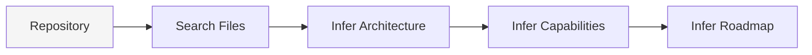
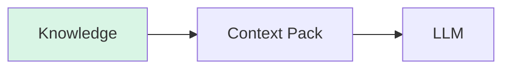
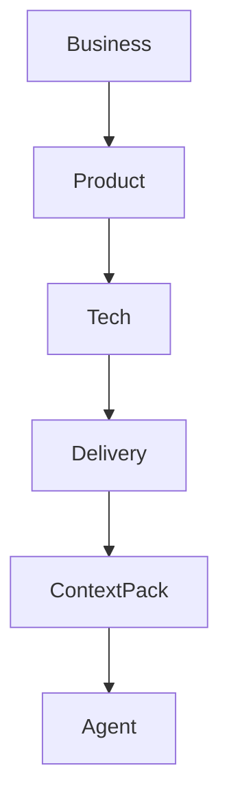
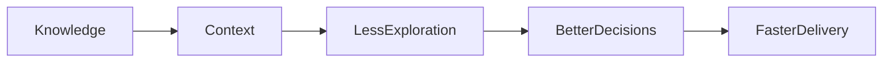

El beneficio principal de Kaddo no es comprimir prompts ni optimizar tokens. Kaddo no comprime
prompts, no resume automáticamente, no elimina tokens y no optimiza dinámicamente una ventana de
contexto.

Kaddo mejora la **eficiencia de contexto** reduciendo exploración innecesaria del repositorio:

```text
Conocimiento
↓
Contexto
↓
Menos exploración
↓
Mejores decisiones
↓
Ahorro de tokens como consecuencia
```

En una frase: **Kaddo reduce la exploración del repositorio convirtiendo el conocimiento del
proyecto en contexto estructurado. El ahorro de tokens es una consecuencia, no el objetivo.**

## El costo real de explorar

La parte costosa de muchas sesiones de desarrollo asistidas por IA no es solo el precio por
token. Es el costo de descubrir conocimiento del proyecto desde cero:

- ¿Qué problema de negocio soporta este código?
- ¿Qué capacidades ya existen?
- ¿Qué decisiones de arquitectura siguen vigentes?
- ¿Qué archivos pertenecen a un Work Item?
- ¿Qué item del roadmap está activo realmente?

Sin estructura, un agente paga ese costo de descubrimiento una y otra vez. Lee archivos, infiere
arquitectura, reconstruye límites de capacidades, adivina ownership y pide más contexto. Esas
lecturas extra se convierten en tokens extra, pero el problema raíz es la exploración.

## Repository Exploration Tax

Sin Kaddo:



Con Kaddo:



El Repository Exploration Tax es el trabajo repetido que un agente hace solo para orientarse antes
de tomar una decisión útil. Kaddo reduce ese costo manteniendo el conocimiento explícito,
estructurado y cerca del código.

## Capas de conocimiento

Kaddo organiza el conocimiento en cuatro capas:



- **Business** explica por qué existe el producto.
- **Product** explica qué capacidades y valor de usuario importan.
- **Tech** explica cómo está construido el sistema y por qué.
- **Delivery** explica cómo evoluciona el producto mediante roadmap y Work Items.

Estas capas existen para reducir exploración. En lugar de obligar a un agente a redescubrir el
producto desde código disperso, Kaddo le da un mapa estable de lo que se sabe, lo que falta y qué
trabajo está activo.

## Por qué ocurre el ahorro de tokens

El ahorro de tokens ocurre porque el contexto estructurado evita lecturas innecesarias. No es el
objetivo principal.

Kaddo mantiene el contexto acotado por diseño:

- `kaddo context` envía metadata y resúmenes, no código fuente.
- Los Work Items aportan front matter, no cuerpos completos.
- Los Work Items activos tienen prioridad sobre historia completada o archivada.
- `kaddo explain` puede enfocarse por scope, tipo o fecha cuando no hace falta ver todo el proyecto.

Eso significa que los tokens se gastan en interpretación y decisiones, no en redescubrir la misma
forma del repositorio en cada chat.

## Tamaño medido de la salida

Los siguientes números siguen siendo útiles, pero deben leerse como evidencia de contexto acotado,
no como una promesa de que Kaddo optimiza tokens directamente.

| Escenario | Work items | Módulos | tokens `context` | tokens `explain` | tokens / work item |
|-----------|-----------|---------|------------------|------------------|--------------------|
| empty     | 0   | 0  | 619    | 305   | — |
| small     | 5   | 0  | 846    | 399   | 169 |
| medium    | 25  | 2  | 1.909  | 724   | 76 |
| large     | 100 | 5  | 5.545  | 1.870 | 55 |
| xlarge    | 500 | 20 | 25.229 | 8.040 | **50** |

> Tokens ≈ caracteres ÷ 4 (promedio aproximado para inglés + Markdown).

El crecimiento es lineal porque el pack es determinista y prioriza metadata. En el caso `xlarge`,
los archivos de conocimiento en disco pesan cerca de **134.000 tokens**, mientras que el context
pack generado pesa **25.229**. El código fuente nunca se lee dentro del pack.

## Loop de eficiencia de contexto



El trabajo de Kaddo es hacer que el conocimiento del proyecto sea más fácil de descubrir que el
código. El menor consumo de tokens aparece cuando los agentes dejan de recorrer el repositorio
solo para entender dónde están.
