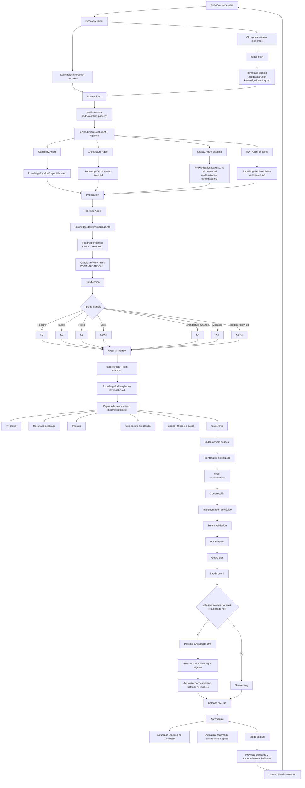

Este es el loop completo de Kaddo como una narrativa. Cada paso muestra el comando, qué aporta
y el artefacto que produce.

| # | Paso | Comando | Produce |
|---|---|---|---|
| 1 | Inicializar | `kaddo init` | `.kaddo/config.yml` |
| 2 | Escanear | `kaddo scan` | `.kaddo/scan.json`, `knowledge/inventory.md` |
| 3 | Context pack | `kaddo context` | `.kaddo/context-pack.md` |
| 4 | Instalar agentes | `kaddo add agents` | `knowledge/agents/*.md` |
| 5 | Understand | `kaddo understand` | `.kaddo/understand.md` |
| 6 | Entender en el LLM | *(tu chat)* | `knowledge/product/capabilities.md`, `knowledge/tech/current-state.md`, `knowledge/delivery/roadmap.md` |
| 7 | Crear desde roadmap | `kaddo create --from roadmap` | `knowledge/delivery/work-items/*.md` |
| 8 | Declarar ownership | `kaddo owners suggest` | front matter `code:` actualizado |
| 9 | Guard | `kaddo guard` | FYI de deriva sobre el `git diff` |
| 10 | Explain | `kaddo explain` | `.kaddo/explain.md`, `.kaddo/explain.json` |

## El loop en detalle



## Los comandos

```bash
kaddo init
kaddo scan
kaddo context
kaddo add agents
kaddo understand
# ── usa tu LLM con .kaddo/context-pack.md + los agentes recomendados para crear
#    capacidades, el baseline de arquitectura y el roadmap ──
kaddo create --from roadmap
kaddo owners suggest
kaddo guard
kaddo explain
```

## Qué ocurre dónde

- **Pasos 1–5 (CLI):** Kaddo prepara contexto determinístico — config, inventario técnico,
  context pack, prompts de agentes y un plan de handoff. Sin LLM, sin API key.
- **Paso 6 (chat LLM):** ejecutas los agentes de Kaddo en tu LLM favorito para convertir ese
  contexto en capacidades, arquitectura y un roadmap. Aquí ocurre la interpretación.
- **Pasos 7–10 (CLI):** Kaddo convierte el roadmap en Work Items, los conecta al código vía
  ownership y cierra el loop — Guard avisa sobre la deriva y Explain resume el estado.

## Cómo se cierra el loop

`kaddo guard` lee el `git diff`, cruza los archivos cambiados con los globs `code:` de cada
artefacto y muestra un **FYI no bloqueante** cuando el conocimiento relacionado no se
actualizó. `kaddo explain` luego reporta lo que Kaddo sabe, qué falta y qué hacer a
continuación — para que la siguiente iteración empiece con contexto completo.

Elige tu punto de partida: [Proyecto nuevo](/es/use-cases/new-project/),
[Proyecto pre-IA](/es/use-cases/pre-ai-project/) o [Proyecto legacy](/es/use-cases/legacy-project/).
