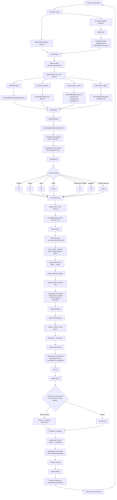

Este es el loop completo de Kaddo como una narrativa. Cada paso muestra el comando, qué aporta
y el artefacto que produce.

| # | Paso | Comando / Skill | Produce |
|---|---|---|---|
| 1 | Inicializar | `kaddo init` | `.kaddo/config.yml` |
| 2 | Escanear | `kaddo scan` | `.kaddo/scan.json`, `knowledge/inventory.md` |
| 3 | Context pack | `kaddo context` | `.kaddo/context-pack.md` |
| 4 | Instalar agentes | `kaddo add agents` | `knowledge/agents/*.md` |
| 5 | Understand | `kaddo understand` | `.kaddo/understand.md` |
| 6 | Entender en el LLM | *(tu chat)* | `capabilities.md`, `current-state.md`, `roadmap.md` |
| 7 | Crear desde roadmap | `kaddo create --from roadmap` | `work-items/draft/WI-001.md` |
| 8 | Refinar | skill work-item-refinement | WI refinado con ACs, scope, refs legacy |
| 9 | Ready | `kaddo ready WI-001` | `work-items/ready/WI-001.md` |
| 10 | Handoff | skill implementation-planning | Plan de implementación + contexto legacy |
| 11 | Implementar | implementation-agent | código + tests |
| 12 | Evidencia + Verificar | `kaddo verify WI-001` | reporte de evidencia, verificación de ACs |
| 13 | Guard | `kaddo guard` | FYI de deriva + intersecciones de riesgos legacy |
| 14 | Completar + Aprender | `kaddo learn WI-001` | `work-items/completed/WI-001.md` + aprendizajes |
| 15 | Explain | `kaddo explain` | `.kaddo/explain.md`, `.kaddo/explain.json` |

## El loop en detalle


```mermaid
flowchart TD
    A[Petición / Necesidad] --> B[Discovery inicial]

    B --> B1[Stakeholders explican contexto]
    B --> B2[CLI aporta señales existentes]
    B2 --> B3[kaddo scan]
    B3 --> B4[Inventario técnico<br/>.kaddo/scan.json<br/>knowledge/inventory.md]

    B1 --> C[Context Pack]
    B4 --> C
    C --> C1[kaddo context<br/>.kaddo/context-pack.md]

    C1 --> D[Entendimiento con LLM + Agentes]
    D --> D1[Capability Agent]
    D --> D2[Architecture Agent]
    D --> D3[Legacy Agent si aplica]
    D --> D4[ADR Agent si aplica]

    D1 --> E1[knowledge/product/capabilities.md]
    D2 --> E2[knowledge/tech/current-state.md]
    D3 --> E3[knowledge/legacy/risks.md<br/>unknowns.md<br/>modernization-candidates.md]
    D4 --> E4[knowledge/tech/decision-candidates.md]

    E1 --> F[Priorización]
    E2 --> F
    E3 --> F
    E4 --> F

    F --> F1[Roadmap Agent]
    F1 --> F2[knowledge/delivery/roadmap.md]
    F2 --> F3[Iniciativas del roadmap<br/>RM-001, RM-002...]
    F3 --> F4[Candidatos de Work Items<br/>WI-CANDIDATE-001...]

    F4 --> G[Clasificación]
    G --> G1{Tipo de cambio}

    G1 -->|Feature| H1[K2]
    G1 -->|Bugfix| H2[K2]
    G1 -->|Hotfix| H3[K1]
    G1 -->|Spike| H4[K2/K3]
    G1 -->|Architecture Change| H5[K4]
    G1 -->|Migration| H6[K4]
    G1 -->|Incident follow-up| H7[K2/K3]

    H1 --> I[Crear Work Item]
    H2 --> I
    H3 --> I
    H4 --> I
    H5 --> I
    H6 --> I
    H7 --> I

    I --> I1[kaddo create --from roadmap]
    I1 --> I2[knowledge/delivery/work-items/WI-*.md]

    I2 --> J[Refinamiento]
    J --> J1[work-item-agent<br/>+ work-item-refinement skill]
    J1 --> J2[ACs · scope · módulos<br/>refs de riesgos legacy si aplica]
    J2 --> J3[kaddo ready WI-001<br/>draft/ → ready/]

    J3 --> K[Implementation Handoff]
    K --> K1[implementation-planning skill]
    K1 --> K2[Ensamblaje de contexto<br/>+ deliberación de diseño<br/>+ contexto legacy si disponible]

    K2 --> L[Implementación]
    L --> L1[implementation-agent]
    L1 --> L2[Código + tests en rama feature]

    L2 --> M[Evidencia + Verificación]
    M --> M1[kaddo verify WI-001]
    M1 --> M2[Recolección de evidencia<br/>Verificación de ACs<br/>Evaluación de completitud]

    M2 --> N[Guard]
    N --> N1[kaddo guard]
    N1 --> N2{¿Deriva de conocimiento?<br/>¿Intersección de riesgo legacy?}

    N2 -->|Deriva o riesgo| N3[Revisar + actualizar conocimiento]
    N2 -->|Limpio| N4[Sin warning]

    N3 --> O[Completar + Aprender]
    N4 --> O

    O --> O1[kaddo learn WI-001<br/>ready/ → completed/]
    O1 --> O2[Aprendizajes capturados<br/>Conocimiento actualizado]

    O2 --> P[Release / Merge]
    P --> P1[kaddo explain]

    P1 --> Q[Proyecto explicado y conocimiento actualizado]
    Q --> R[Nuevo ciclo de evolución]
    R --> A
```

## Los comandos

```bash
kaddo init
kaddo scan
kaddo context
kaddo add agents
kaddo understand
# ── usa tu LLM con .kaddo/context-pack.md + los agentes recomendados para crear
#    capacidades, el baseline de arquitectura y el roadmap ──
kaddo create --from roadmap
# ── refina con work-item-agent, marca ready ──
kaddo ready WI-001
# ── Implementation Handoff (implementation-planning skill) ──
# ── implementa con implementation-agent ──
kaddo verify WI-001
kaddo guard
kaddo learn WI-001
kaddo explain
```

## Qué ocurre dónde

- **Pasos 1–5 (CLI):** Kaddo prepara contexto determinístico — config, inventario técnico,
  context pack, prompts de agentes y un plan de handoff. Sin LLM, sin API key.
- **Paso 6 (chat LLM):** ejecutas los agentes de Kaddo en tu LLM favorito para convertir ese
  contexto en capacidades, arquitectura y un roadmap. Aquí ocurre la interpretación.
- **Pasos 7–9 (CLI + LLM):** Kaddo convierte el roadmap en Work Items, el work-item-agent
  los refina y tú los marcas ready para implementación.
- **Pasos 10–14 (CLI + LLM):** El handoff ensambla contexto (incluido contexto legacy cuando
  está disponible), el implementation-agent construye, `kaddo verify` recolecta evidencia y
  verifica ACs, Guard avisa sobre deriva e intersecciones de riesgos legacy, se capturan
  aprendizajes y Explain resume el estado.

## Quién produjo qué (Agent Trace)

Cada agente de Kaddo termina su respuesta con un **Agent Trace** para que el flujo sea auditable —
quién produjo el resultado, qué produjo y qué sigue:

```text
Agent: roadmap-agent
Produced: knowledge/delivery/roadmap.md
Next: kaddo create --from roadmap → work-item-agent

Agent: work-item-agent
Produced: knowledge/delivery/work-items/draft/WI-001.md
Next: kaddo ready → implementation-planning skill → implementation-agent

Agent: implementation-agent
Produced: código · tests
Next: kaddo verify → kaddo guard → kaddo learn → kaddo explain
```

Solo el **implementation-agent** puede sugerir una rama de Git (respetando la estrategia de Git del
proyecto); el roadmap-agent y el work-item-agent nunca lo hacen. Ver la
[matriz de responsabilidad](/es/modules/agents/#responsibility-boundaries--agent-trace).

## Cómo se cierra el loop

`kaddo guard` lee el `git diff`, cruza los archivos cambiados con los globs `code:` de cada
artefacto y muestra un **FYI no bloqueante** cuando el conocimiento relacionado no se
actualizó. `kaddo explain` luego reporta lo que Kaddo sabe, qué falta y qué hacer a
continuación — para que la siguiente iteración empiece con contexto completo.

Elige tu punto de partida: [Proyecto nuevo](/es/use-cases/new-project/),
[Proyecto pre-IA](/es/use-cases/pre-ai-project/) o [Proyecto legacy](/es/use-cases/legacy-project/).
