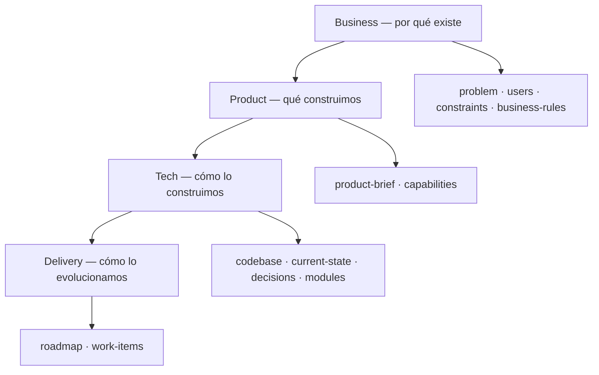
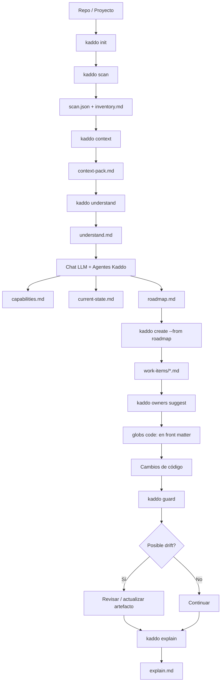
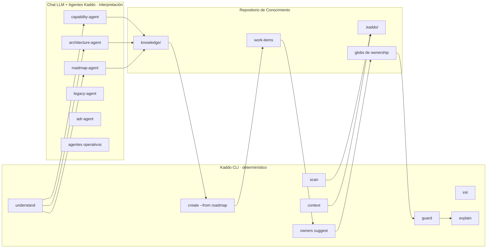
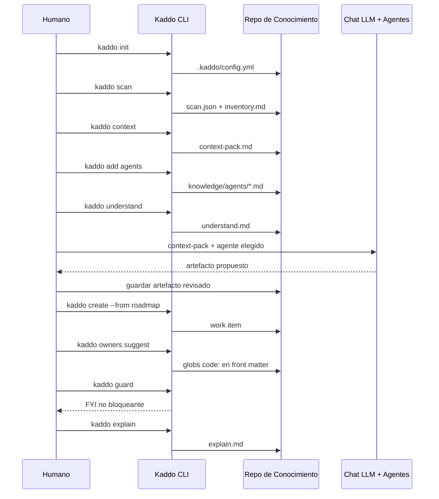
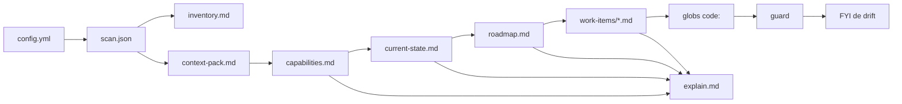
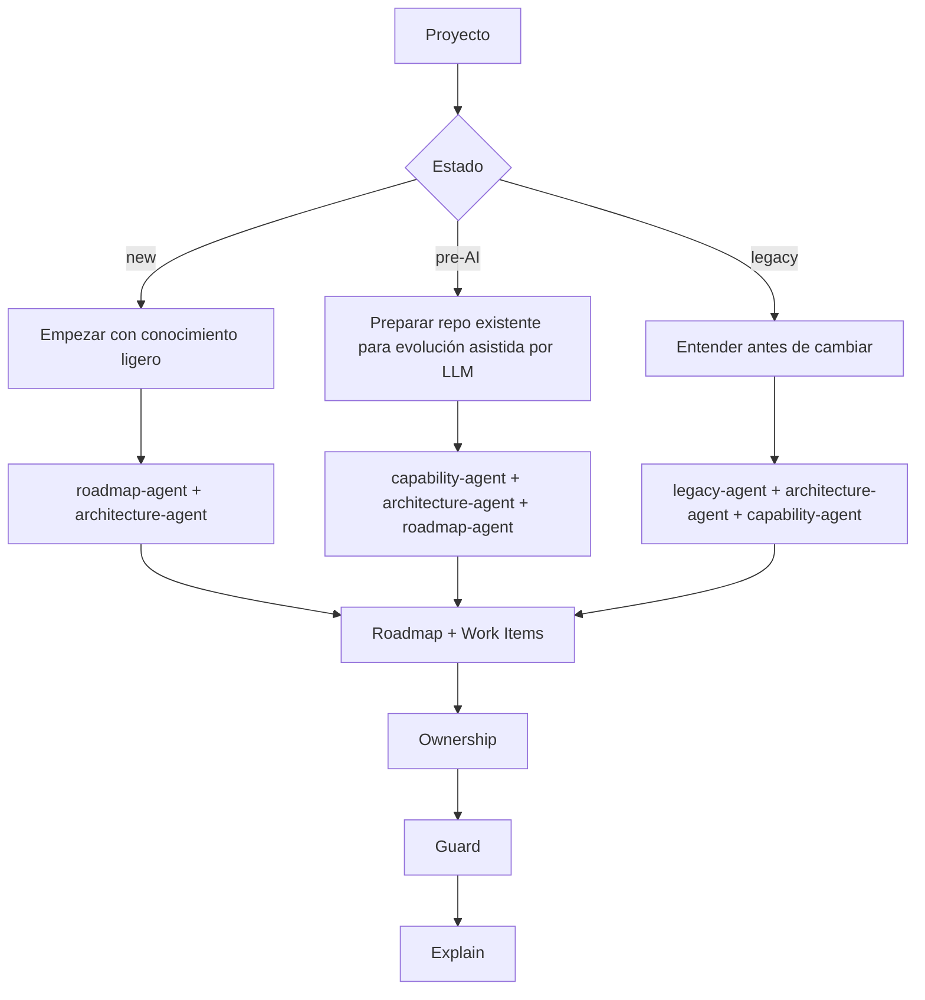
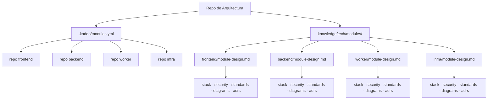
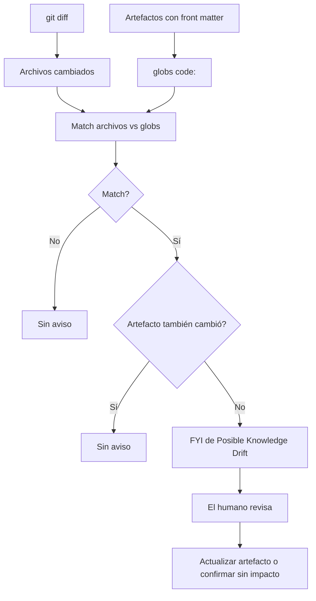
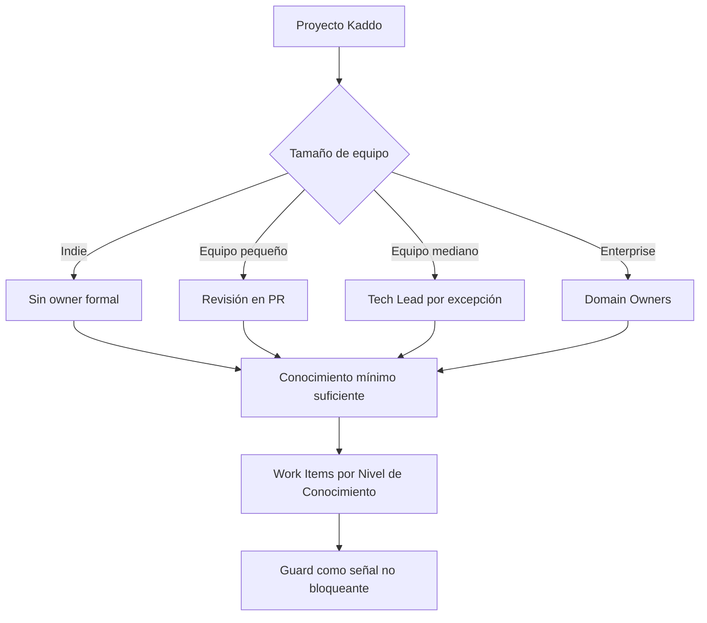
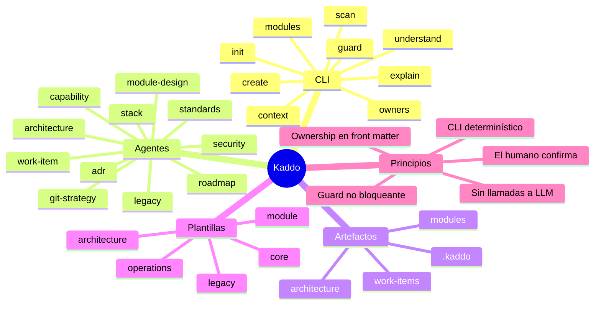

Esta página es el mapa visual de Kaddo. Muestra el **knowledge loop implementado (v2.6+)**:
qué hace el CLI determinístico, qué hacen tus agentes LLM, cómo se conectan los artefactos
y cómo encajan Guard, multirepo y la gobernanza. Haz clic en cualquier diagrama para
abrirlo a pantalla completa.

> Estos diagramas describen comportamiento que existe hoy. **No** implican ninguna
> automatización futura — mira [Qué no significan los diagramas](#qué-no-significan-los-diagramas).

## Capas de conocimiento (macro-flujo)

Kaddo enmarca todo el proyecto en cuatro capas macro bajo `knowledge/`. Cada una responde
una pregunta y se mantiene conectada con la de arriba.

`kaddo bootstrap` siembra la base mínima (Business + Product + `tech/codebase.md`);
Delivery y las decisiones emergen después vía agentes y trabajo real.

## Kaddo Knowledge Loop

El loop completo, desde un repo en crudo hasta un estado de conocimiento explicado. Los
pasos del CLI son determinísticos; el paso con agentes ocurre en tu propio chat LLM.

## CLI vs LLM

Kaddo trabaja en dos capas. El CLI es determinístico y nunca llama a un LLM; tu chat LLM
(con los prompts de agentes de Kaddo) hace la interpretación. El Repositorio de
Conocimiento es el terreno común entre ambos.

## Humano ↔ CLI ↔ LLM

El handoff operativo. El humano ejecuta cada comando y guarda cada artefacto revisado —
Kaddo nunca llama al LLM por ti.

## Grafo de artefactos

Cómo cada artefacto alimenta al siguiente, desde `config.yml` hasta `explain.md`.

## Estados del proyecto

`kaddo init` registra el estado del proyecto. El estado cambia a qué agentes recurres
primero, pero el loop y los artefactos son los mismos.

## Mapa multirepo

Desde el repo de arquitectura mapeas repos secundarios como módulos; cada uno obtiene su
propia estructura de conocimiento. Los archivos existentes nunca se sobrescriben.

## Guard Lite

Guard lee `git diff`, matchea los archivos cambiados contra los globs `code:` declarados y
emite un FYI **no bloqueante** solo cuando un artefacto dueño no se actualizó en el mismo
diff. Es silencioso cuando ningún artefacto declara ownership.

## Niveles de gobernanza

La gobernanza escala según el tamaño de equipo. Kaddo nunca la impone — la revisión ocurre
por excepción.

## Kaddo de un vistazo

Un mapa de alto nivel de comandos, agentes, artefactos, plantillas y principios.

## Qué no significan los diagramas

Para mantener expectativas honestas, estos diagramas **no** implican que:

- Kaddo llame a un LLM — tú ejecutas los agentes en tu propio chat.
- Guard bloquee — siempre es un FYI no bloqueante.
- El ownership se infiera — los globs `code:` se declaran y los confirma un humano.
- Kaddo escanee repos remotos o llame a APIs de Git/GitHub.
- Kaddo genere estos diagramas automáticamente — son docs escritos a mano.

---

Siguiente: recorre el mismo loop con artefactos reales en los [Ejemplos](/es/examples/), o
lee el [Prompt Workflow](/es/playbook/prompt-workflow/) paso a paso.
