Esta página es el mapa visual de Kaddo. Muestra el **knowledge loop implementado (v2.6+)**:
qué hace el CLI determinístico, qué hacen tus agentes LLM, cómo se conectan los artefactos
y cómo encajan Guard, multirepo y la gobernanza. Haz clic en cualquier diagrama para
abrirlo a pantalla completa.

> Estos diagramas describen comportamiento que existe hoy. **No** implican ninguna
> automatización futura — mira [Qué no significan los diagramas](#qué-no-significan-los-diagramas).

## Momentos de operación

Kaddo madura el conocimiento de un proyecto en cuatro momentos. Ver
[Momentos de operación](/es/operating-moments/) para el detalle completo.

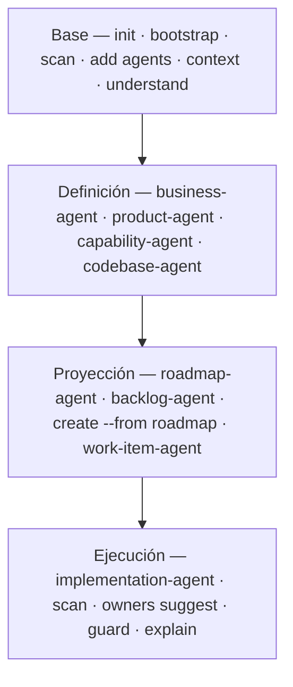

## Capas de conocimiento (macro-flujo)

Kaddo enmarca todo el proyecto en cuatro capas macro bajo `knowledge/`. Cada una responde
una pregunta y se mantiene conectada con la de arriba.

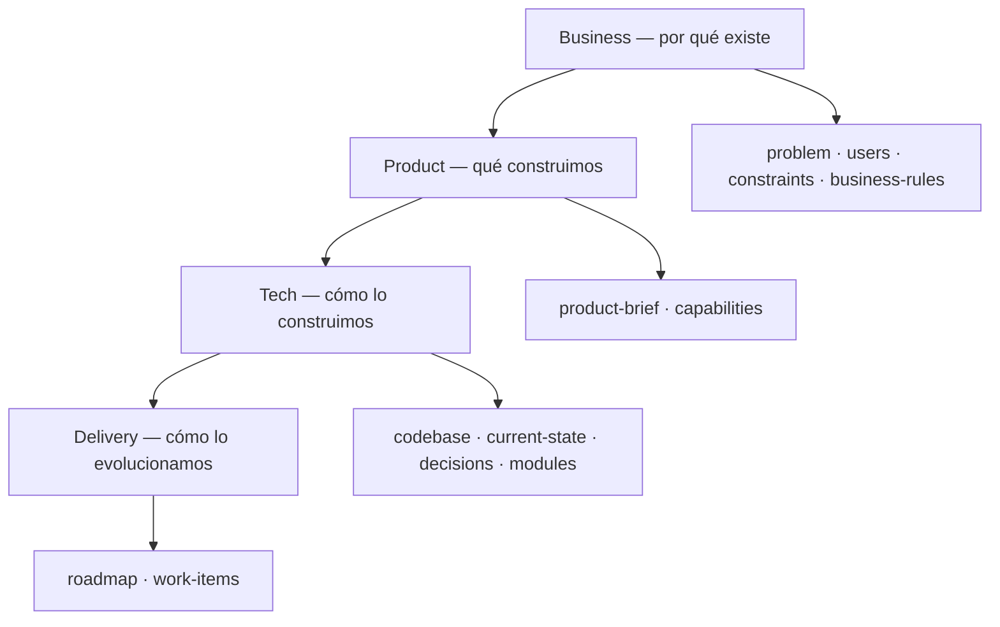

`kaddo bootstrap` siembra la base mínima (Business + Product + `tech/codebase.md`);
Delivery y las decisiones emergen después vía agentes y trabajo real.

## Repository Exploration Tax

Sin conocimiento estructurado, los agentes gastan parte de cada sesión redescubriendo el proyecto.
Con Kaddo, pueden empezar desde un context pack construido a partir de conocimiento explícito.

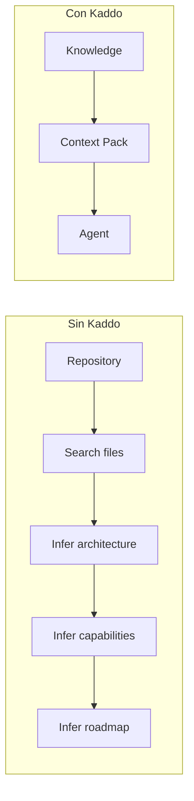

## Madurez del conocimiento

Kaddo reconoce el conocimiento por el **type del front-matter** (no por el nombre) y reporta
una madurez por capa. El conocimiento crece de consolidado a trazable a medida que el
proyecto lo gana.

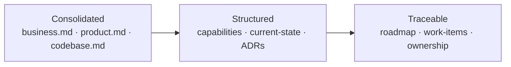

## Kaddo Knowledge Loop

El loop completo, desde un repo en crudo hasta un estado de conocimiento explicado. Los
pasos del CLI son determinísticos; el paso con agentes ocurre en tu propio chat LLM.

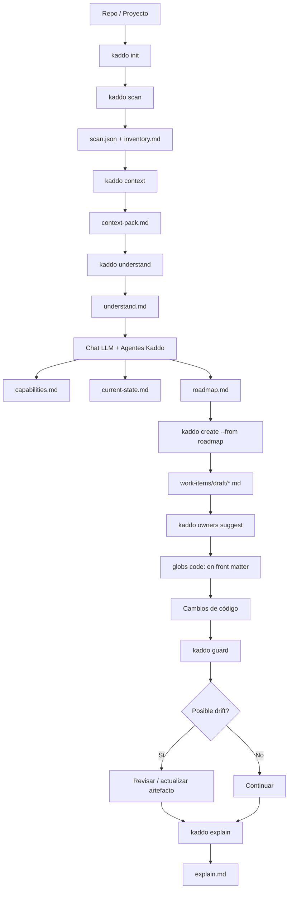

## Flujo de agentes y límites de responsabilidad

Cada agente produce conocimiento y hace handoff al siguiente. Solo el **implementation-agent**
puede sugerir una rama de Git — y únicamente respetando la estrategia de Git del proyecto. El
roadmap-agent y el work-item-agent nunca sugieren ramas ni commits.

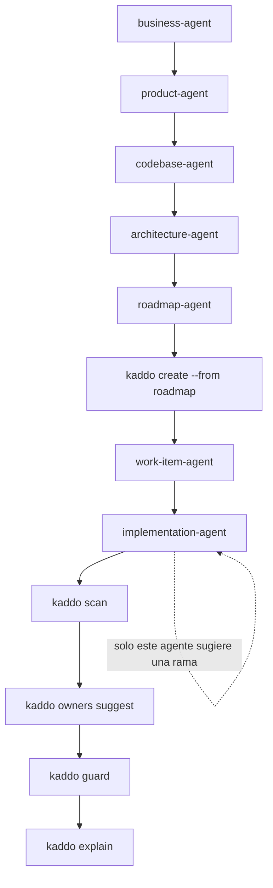

## Captura de backlog (idea → trabajo estructurado)

El **backlog-agent** convierte cualquier idea, nota o transcripción cruda en un draft de Work Item
o un candidato de roadmap. Nunca refina, implementa ni auto-ejecuta el siguiente agente — siempre
decide un humano qué sigue.

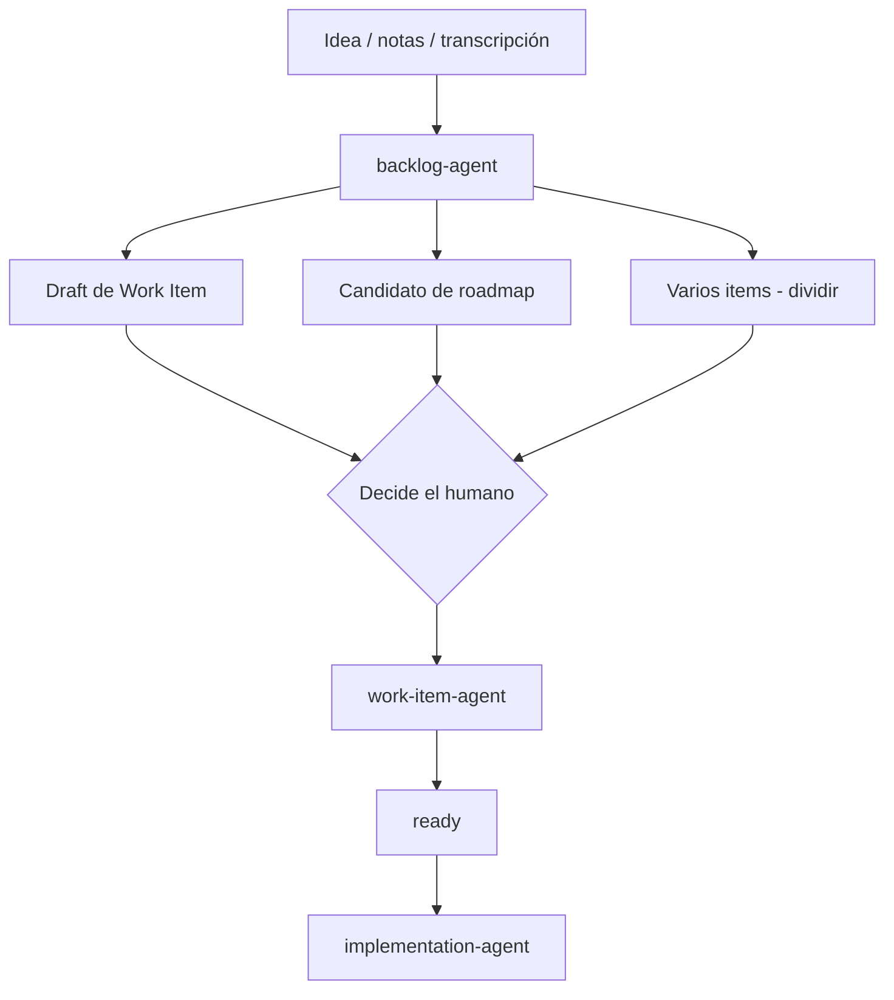

| Idea | salida del backlog-agent |
|---|---|
| "Exportar tareas a CSV" | un draft de Work Item |
| "Un sistema completo de autenticación" | un candidato de roadmap |
| "Login · Reportes · Notificaciones" | 3 backlog items |

## Roles de comandos: scan · context · explain · understand

Cada comando tiene un rol distinto. `understand` recomienda el siguiente paso a partir del estado
**real** del conocimiento, no solo del `project.state` configurado.

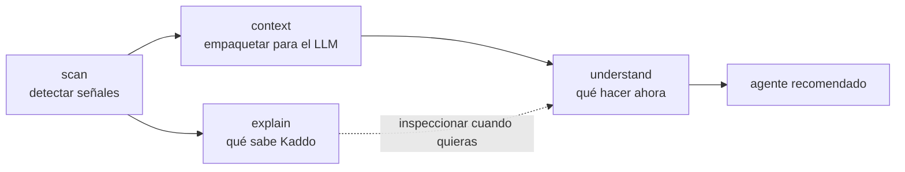

Todos los comandos siguen la misma forma — y `scan`/`context`/`explain`/`understand` imprimen las
últimas dos líneas como pie:

```text
Pregunta  →  Comando  →  Salida  →  Siguiente acción
```

| Pregunta | Comando | Salida | Siguiente |
|---|---|---|---|
| ¿Qué hay en el repo? | `scan` | scan.json · inventory | explain / context |
| ¿Qué sabe Kaddo? | `explain` | explain.md | understand |
| ¿Qué le doy a un LLM? | `context` | context-pack.md | agente recomendado |
| ¿Qué debería hacer ahora? | `understand` | understand.md + recomendación | la acción recomendada |

## Idioma del conocimiento del proyecto

El idioma del proyecto (`en`/`es`, definido en `kaddo init`) fluye a todo lo que Kaddo genera —
pero no al CLI, que sigue en inglés.

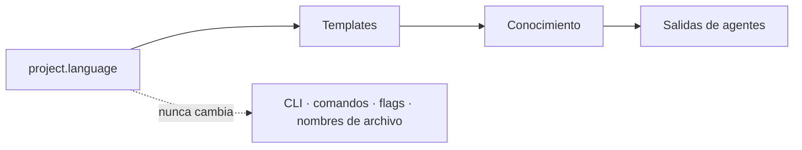

## Descubrimiento unificado de conocimiento

Cada comando descubre los artefactos de conocimiento a través de un único servicio compartido,
para que `explain`, `context`, `understand`, `owners suggest` y `guard` siempre coincidan en qué
existe. Los Work Items se descubren recursivamente en las subcarpetas del lifecycle.

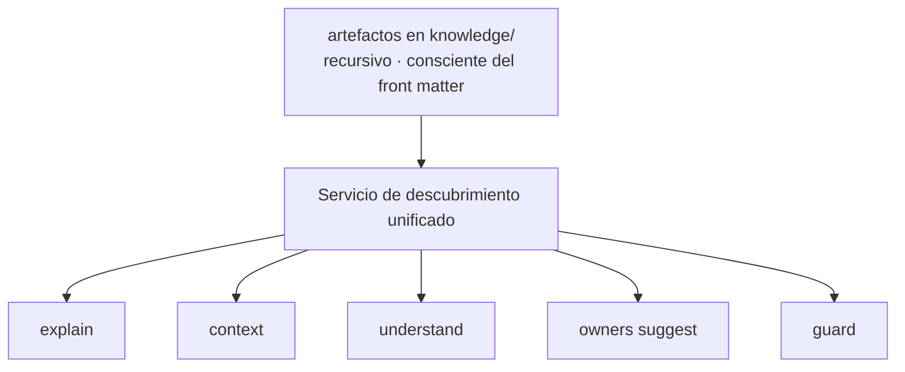

## CLI vs LLM

Kaddo trabaja en dos capas. El CLI es determinístico y nunca llama a un LLM; tu chat LLM
(con los prompts de agentes de Kaddo) hace la interpretación. El Repositorio de
Conocimiento es el terreno común entre ambos.

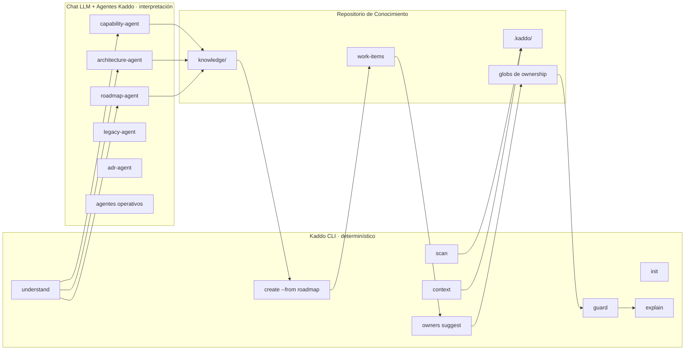

## Humano ↔ CLI ↔ LLM

El handoff operativo. El humano ejecuta cada comando y guarda cada artefacto revisado —
Kaddo nunca llama al LLM por ti.

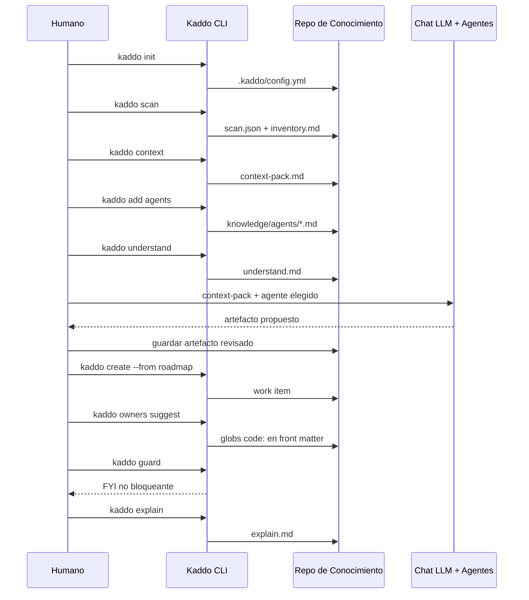

## Grafo de artefactos

Cómo cada artefacto alimenta al siguiente, desde `config.yml` hasta `explain.md`.

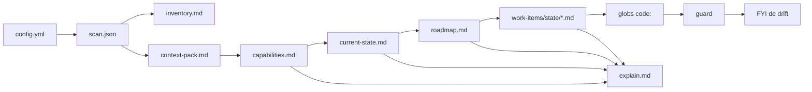

## Estados del proyecto

`kaddo init` registra el estado del proyecto. El estado cambia a qué agentes recurres
primero, pero el loop y los artefactos son los mismos.

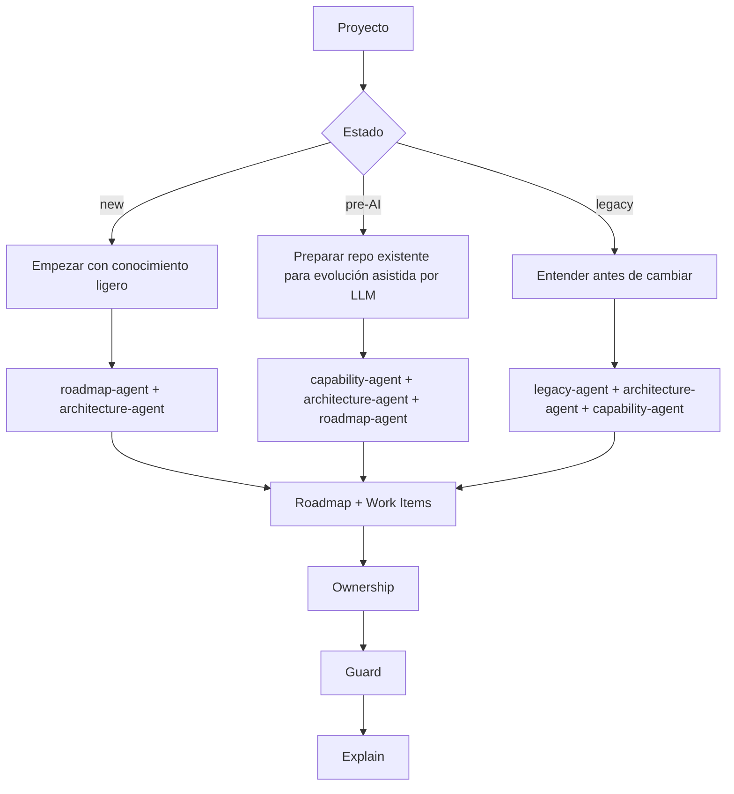

## Mapa multirepo

Desde el repo de arquitectura mapeas repos secundarios como módulos; cada uno obtiene su
propia estructura de conocimiento. Los archivos existentes nunca se sobrescriben.

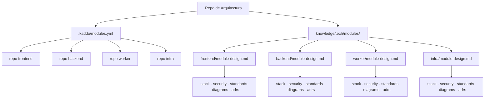

## Knowledge Capsules (contexto externo)

Un proyecto exporta una [Knowledge Capsule](/es/knowledge-capsules/); otro la importa como contexto
externo — sin mapeo multirepo, sin acceso al código.

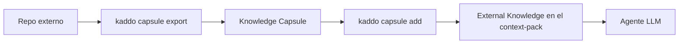

## Exportar el grafo de conocimiento

`kaddo graph export` convierte las relaciones ya declaradas en tu conocimiento en un
[grafo de conocimiento](/es/knowledge-graph-export/) liviano basado en archivos — para onboarding,
análisis de impacto y selección de contexto. Sin base de grafos, sin leer código fuente.

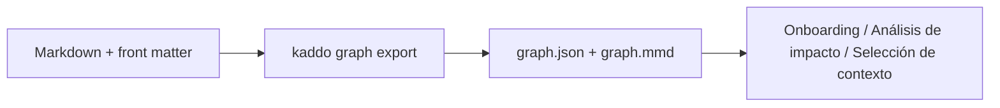

Los scopes difieren por intención:

```text
Grafo active: contexto de delivery actual (draft, ready, in-progress, blocked)
Grafo all:    mapa completo (+ completed; archived excluido por defecto)
Guard:        ownership active + completed (archived excluido por defecto)
```

Cada exportación también califica la **calidad de las relaciones** y escribe `graph-hints.md` —
sugerencias no bloqueantes para enriquecer el front matter. El `graph-agent` convierte los hints
en metadata precisa que tú confirmas y aplicas:

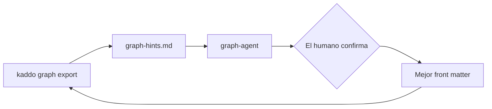

## Habilidades (capacidades reutilizables)

Los agentes orquestan el flujo; las [habilidades](/es/skills/) estandarizan *cómo* hacer bien lo
común. Un agente aplica una o más skills para producir salidas consistentes.

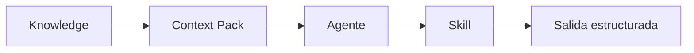

## Servidor MCP (solo lectura)

Los agentes e IDEs pueden leer el conocimiento curado de Kaddo directamente mediante el servidor
de solo lectura [`@kaddo/mcp`](/es/mcp-server/) — sin copiar y pegar, sin escanear código.

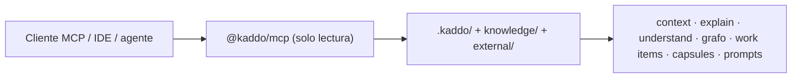

## Ownership asistido por agente

El ownership-agent propone globs `code:` precisos; tú confirmas y los aplicas. `owners suggest` es
la herramienta manual/override (con normalización de globs y validación de rutas).

```mermaid
flowchart LR
    S[kaddo scan] --> C[kaddo context]
    C --> O[ownership-agent]
    O --> H{El humano confirma}
    H --> A[kaddo owners suggest / apply]
    A --> G[kaddo guard]
```

## Flujo de ownership

El ownership lo propone un agente a partir de las señales del scan y lo **confirma un
humano** antes de registrarlo en el artefacto. `code:` acepta múltiples globs.

```mermaid
flowchart LR
    A[kaddo scan] --> B[kaddo owners suggest]
    B --> C[el agente interpreta señales]
    C --> D[el humano confirma]
    D --> E[ownership registrado en el artefacto: globs code:]
    E --> F[kaddo guard relaciona los cambios de código]
```

## Roadmap → Candidatos → Work Items materializados

Un roadmap lista **candidatos**, no Work Items. El roadmap-agent (en tu chat LLM) escribe el
roadmap en cualquier formato soportado; el CLI de Kaddo parsea los candidatos de forma
determinista; tú los materializas en Work Items reales con `kaddo create --from roadmap`.
`explain` y `understand` reportan la brecha (candidatos restantes).

```mermaid
flowchart LR
    A[roadmap-agent en chat LLM] --> B[knowledge/delivery/roadmap.md<br/>tabla · viñetas · checklist · mixto]
    B --> C[Candidatos parseados<br/>WI-001, WI-002, …]
    C -->|kaddo create --from roadmap| D[Work Items materializados<br/>knowledge/delivery/work-items/draft/]
    C -.candidatos restantes.-> E[explain · understand<br/>candidatos vs materializados]
    D -.-> E
```

## Workspace lifecycle de Work Items

Los Work Items son un area de trabajo activa organizada por estado del lifecycle. Fase e
iniciativa permanecen como metadata de front matter; no crean carpetas.

Cada Work Item tiene un **tipo** — `feature`, `bugfix`, `hotfix`, `spike` o `chore` — que recorre
el mismo lifecycle. `chore` evita que el trabajo de mantenimiento/tooling/config/infra se
etiquete erróneamente como feature.

```mermaid
flowchart TD
    T["type: feature · bugfix · hotfix · spike · chore"] --> A
    A[Roadmap Candidate] --> B[Draft]
    B --> C[Ready]
    C --> D[In Progress]
    D --> E[Completed]
    E --> F[Archived]
    D --> G[Blocked]
    G --> C
```

## Ciclo de entrega de un Work Item

De un Work Item a un commit, manteniendo el conocimiento sincronizado. El CLI de Kaddo
nunca toca git: el agente que implementa (work-item-agent) crea la rama y commitea solo con
tu confirmación.

```mermaid
flowchart TD
    A[Roadmap] --> B[Crear Work Item]
    B --> C[Rama — agente, según git strategy]
    C --> D[Implementación]
    D --> E[kaddo scan]
    E --> F[kaddo owners suggest → el humano confirma]
    F --> G[kaddo guard antes del commit]
    G --> H[Actualizar conocimiento: ADR · capabilities · current-state]
    H --> I[Review humano]
    I --> J[Commit ej. feat scope: mensaje]
```

## Guard Lite

Guard lee `git diff`, matchea los archivos cambiados contra los globs `code:` declarados y
emite un FYI **no bloqueante** solo cuando un artefacto dueño no se actualizó en el mismo
diff. Es silencioso cuando ningún artefacto declara ownership.

```mermaid
flowchart TD
    A[git diff] --> B[Archivos cambiados]
    C[Artefactos con front matter] --> D[globs code:]
    B --> E[Match archivos vs globs]
    D --> E
    E --> F{Match?}
    F -->|No| G[Sin aviso]
    F -->|Sí| H{Artefacto también cambió?}
    H -->|Sí| I[Sin aviso]
    H -->|No| J[FYI de Posible Knowledge Drift]
    J --> K[El humano revisa]
    K --> L[Actualizar artefacto o confirmar sin impacto]
```

## Niveles de gobernanza

La gobernanza escala según el tamaño de equipo. Kaddo nunca la impone — la revisión ocurre
por excepción.

```mermaid
flowchart TD
    A[Proyecto Kaddo] --> B{Tamaño de equipo}
    B -->|Indie| C[Sin owner formal]
    B -->|Equipo pequeño| D[Revisión en PR]
    B -->|Equipo mediano| E[Tech Lead por excepción]
    B -->|Enterprise| F[Domain Owners]
    C --> G[Conocimiento mínimo suficiente]
    D --> G
    E --> G
    F --> G
    G --> H[Work Items por Nivel de Conocimiento]
    H --> I[Guard como señal no bloqueante]
```

## Kaddo de un vistazo

Un mapa de alto nivel de comandos, agentes, artefactos, plantillas y principios.

```mermaid
mindmap
  root((Kaddo))
    CLI
      init
      scan
      context
      understand
      create
      owners
      guard
      explain
      modules
    Agentes
      capability
      architecture
      roadmap
      legacy
      adr
      work-item
      git-strategy
      security
      standards
      stack
      module-design
    Artefactos
      .kaddo
      architecture
      work-items
      modules
    Plantillas
      core
      architecture
      module
      operations
      legacy
    Principios
      CLI determinístico
      Sin llamadas a LLM
      El humano confirma
      Guard no bloqueante
      Ownership en front matter
```

## Qué no significan los diagramas

Para mantener expectativas honestas, estos diagramas **no** implican que:

- Kaddo llame a un LLM — tú ejecutas los agentes en tu propio chat.
- Guard bloquee — siempre es un FYI no bloqueante.
- El ownership se infiera — los globs `code:` se declaran y los confirma un humano.
- Kaddo escanee repos remotos o llame a APIs de Git/GitHub.
- Kaddo genere estos diagramas automáticamente — son docs escritos a mano.

---

Siguiente: recorre el mismo loop con artefactos reales en los [Ejemplos](/es/examples/), o
lee el [Prompt Workflow](/es/playbook/prompt-workflow/) paso a paso.
