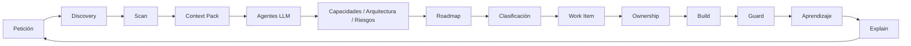

Kaddo tiene un único loop práctico:

```bash
kaddo init          # estado: new | pre-ai | legacy, tamaño de equipo, estructura
kaddo scan          # inventario técnico determinístico → .kaddo/scan.json
kaddo context       # context pack para el LLM → .kaddo/context-pack.md
kaddo add agents    # instala los agent prompt packs
kaddo understand    # plan guiado de handoff CLI → LLM
# ── usa tu LLM con el context pack + agentes para crear
#    capacidades, arquitectura y un roadmap ──
kaddo create --from roadmap   # convierte un candidato del roadmap en un Work Item
kaddo owners suggest          # declara el ownership (code:) en el Work Item
kaddo guard                   # detecta posible deriva del conocimiento
kaddo explain                 # resume lo que Kaddo sabe actualmente
```

En una frase: **escanea el repo → prepara el contexto → usa agentes en tu LLM → crea work
items guiados por el roadmap → conecta el conocimiento al código → vigila la deriva →
explica el estado.**



## CLI vs agentes LLM

Kaddo trabaja en dos capas, y el reparto es intencional.

| Capa | Responsabilidad |
|---|---|
| **Kaddo CLI (determinístico)** | inicializar la estructura de conocimiento, escanear señales, generar context packs, instalar prompts de agentes, guiar el handoff, crear work items, declarar ownership, detectar deriva, explicar el estado del proyecto |
| **Chat LLM (interpretación)** | extraer capacidades, reconstruir arquitectura, proponer un roadmap, identificar riesgos, redactar artefactos estructurados |

> El CLI prepara y guarda el contexto. Tu LLM lo interpreta usando los agentes de Kaddo.
> **Kaddo no llama a un LLM por defecto** y nunca requiere una API key.

## Proyectos nuevos, pre-IA y legacy

Kaddo se adapta al estado de tu proyecto.

| Estado | Qué hace Kaddo |
|---|---|
| **new** | Empieza con una estructura mínima de conocimiento (roadmap, work items, contexto mínimo) sin sobrecarga de proceso. |
| **pre-IA** | Escanea el repo, prepara un context pack y entiéndelo con agentes antes de evolucionar. |
| **legacy** | Mapea el ownership de forma gradual e identifica zonas de riesgo antes de cambiar el código. |

`kaddo init` pregunta el estado del proyecto, el tamaño del equipo y la estructura del
repositorio, y el resto de los comandos adaptan su guía en consecuencia.

## Lo que Kaddo no hace

- **No** es un generador de código.
- **No** es un framework de ejecución de agentes — entrega *prompts* de agentes, no los ejecuta.
- **No** reemplaza a Jira, Linear ni herramientas de documentación.
- **No** es una plataforma.
- **No** llama a un LLM, requiere API key ni infiere la verdad del negocio.
- **No** reemplaza la revisión humana.
