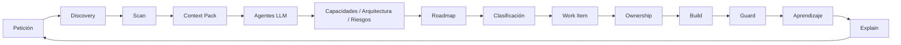

Kaddo madura el conocimiento de un proyecto en cuatro **momentos de operación** — **Base →
Definición → Proyección → Ejecución**. Esta página es el loop práctico; ver
[Momentos de operación](/es/operating-moments/) para los comandos, agentes y resultado esperado de
cada momento.

Kaddo tiene un único loop práctico:

```bash
kaddo init          # estado: new | pre-ai | legacy, tamaño de equipo, estructura
kaddo bootstrap     # proyectos nuevos: base de conocimiento inicial (Business → Product → Tech → Delivery)
kaddo scan          # inventario técnico determinístico → .kaddo/scan.json
kaddo context       # context pack para el LLM → .kaddo/context-pack.md
kaddo add agents    # instala los agent prompt packs
kaddo understand    # plan guiado de handoff CLI → LLM
# ── usa tu LLM con el context pack + agentes para crear
#    capacidades, arquitectura y un roadmap ──
kaddo create --from roadmap   # convierte un candidato del roadmap en un Work Item
kaddo owners suggest          # declara el ownership (code:) en el Work Item
kaddo guard                   # detecta posible deriva del conocimiento
kaddo explain                 # resume lo que Kaddo sabe actualmente
```

En una frase: **escanea el repo → prepara el contexto → usa agentes en tu LLM → crea work
items guiados por el roadmap → conecta el conocimiento al código → vigila la deriva →
explica el estado.**

Las ideas nuevas pueden entrar al loop en cualquier punto mediante el
[`backlog-agent`](/es/modules/agents/), que las captura como draft de Work Item o candidato de
roadmap antes del refinamiento — siempre decides tú el siguiente paso.



## CLI vs agentes LLM

Kaddo trabaja en dos capas, y el reparto es intencional.

| Capa | Responsabilidad |
|---|---|
| **Kaddo CLI (determinístico)** | inicializar la estructura de conocimiento, escanear señales, generar context packs, instalar prompts de agentes, guiar el handoff, crear work items, declarar ownership, detectar deriva, explicar el estado del proyecto |
| **Chat LLM (interpretación)** | extraer capacidades, reconstruir arquitectura, proponer un roadmap, identificar riesgos, redactar artefactos estructurados |

> El CLI prepara y guarda el contexto. Tu LLM lo interpreta usando los agentes de Kaddo.
> **Kaddo no llama a un LLM por defecto** y nunca requiere una API key.

## Qué hace cada comando

Estos cuatro comandos suelen confundirse — hacen cosas distintas:

| Comando | Qué hace | Actualiza |
|---|---|---|
| `kaddo scan` | Detecta la estructura técnica (stack, carpetas, señales) | `.kaddo/scan.json`, `knowledge/inventory.md` |
| `kaddo context` | Empaqueta el conocimiento existente para tu LLM | `.kaddo/context-pack.md` / `.json` |
| `kaddo understand` | Recomienda el siguiente paso + agente desde el estado real (fase) | `.kaddo/understand.md` |
| `kaddo explain` | Resume lo que Kaddo sabe (por capa) | `.kaddo/explain.md` / `.json` |

## Intención vs realidad

Kaddo mantiene **intención** y **realidad** separadas — responden preguntas distintas:

| Artefacto | Significado |
|---|---|
| `knowledge/tech/codebase.md` | **Intención** — cómo planeamos construirlo |
| `knowledge/tech/current-state.md` | **Realidad** — cómo está construido de verdad (opcional, recomendado) |
| ADR (`knowledge/tech/decisions/`) | **Razón de la decisión** — por qué se decidió |
| `.kaddo/scan.json` | **Señales** — lo que detectó el CLI |

`current-state.md` no reemplaza a `codebase.md`: uno es el plan, el otro la verdad.

## Ciclo de entrega de un Work Item

Cuando creas un Work Item, Kaddo define un ciclo de entrega repetible que mantiene código y
conocimiento evolucionando juntos. **El CLI de Kaddo nunca toca git.** La creación de la
rama es parte del protocolo del *agente que implementa* (configurado en el prompt del
`work-item-agent`): el agente **crea una rama primero** para que el trabajo no caiga en
`main`, y **nunca commitea, hace push ni merge sin tu confirmación**.

```txt
Roadmap → Crear Work Item → Rama (agente) → Implementación → Scan → Ownership → Guard →
Actualizar conocimiento → Review → Commit (con confirmación)
```

1. **Crear** — `kaddo create --from roadmap` → `knowledge/delivery/work-items/`.
2. **Rama** — el agente que implementa crea una rama según tu Git strategy
   (`.kaddo/git.yml`, por defecto `feature/WI-001-<slug>`; también `bugfix/`, `hotfix/`,
   `spike/`) **antes** de tocar código, para que nada caiga en la rama por defecto por error.
3. **Implementar** — tú o tu agente hacen el cambio.
4. **Scan** — tras nuevos módulos/migraciones/contratos: `kaddo scan`.
5. **Ownership** — `kaddo owners suggest` (el agente propone globs `code:`, el humano confirma).
6. **Guard** — **antes de commitear**, corre `kaddo guard` para detectar knowledge drift.
7. **Actualizar conocimiento** — registra lo que cambió:
   | Cambio | Actualiza |
   |---|---|
   | Nueva decisión de arquitectura | ADR en `knowledge/tech/decisions/` |
   | Nueva capacidad | `knowledge/product/capabilities.md` |
   | Cambio estructural importante | `knowledge/tech/current-state.md` (realidad) |
8. **Review** — validación humana.
9. **Commit** — el agente sugiere `feat(tasks): add task reminders` y commitea **solo con tu
   confirmación explícita**; nunca hace push ni merge por su cuenta.

`kaddo understand` imprime este ciclo cuando hay un Work Item activo. Las reglas de rama y
commit viven en el prompt del `work-item-agent` — el CLI de Kaddo nunca corre git.

## Declarar ownership

El ownership se declara en los artefactos y lo confirma un humano:

```txt
kaddo scan → kaddo context → ownership-agent → el humano confirma → kaddo owners suggest → kaddo guard
```

El **ownership-agent** propone globs `code:` precisos; `kaddo owners suggest` es la herramienta
manual / override (normaliza rutas como `src/cli` → `src/cli/**`, las valida y advierte por globs
amplios como `src/**`).

`code:` acepta **múltiples globs**:

```yaml
code:
  - src/tasks/**
  - src/projects/**
  - tests/tasks/**
```

Los agentes (instalados en `knowledge/agents/<capa>/`) proponen los globs a partir de las
señales del scan; tú los confirmas. Luego Guard relaciona los cambios de código con el
artefacto dueño.

## Proyectos nuevos, pre-IA y legacy

Kaddo se adapta al estado de tu proyecto.

| Estado | Qué hace Kaddo |
|---|---|
| **new** | Empieza con una estructura mínima de conocimiento (roadmap, work items, contexto mínimo) sin sobrecarga de proceso. |
| **pre-IA** | Escanea el repo, prepara un context pack y entiéndelo con agentes antes de evolucionar. |
| **legacy** | Mapea el ownership de forma gradual e identifica zonas de riesgo antes de cambiar el código. |

`kaddo init` pregunta el estado del proyecto, el tamaño del equipo y la estructura del
repositorio, y el resto de los comandos adaptan su guía en consecuencia.

## Lo que Kaddo no hace

- **No** es un generador de código.
- **No** es un framework de ejecución de agentes — entrega *prompts* de agentes, no los ejecuta.
- **No** reemplaza a Jira, Linear ni herramientas de documentación.
- **No** es una plataforma.
- **No** llama a un LLM, requiere API key ni infiere la verdad del negocio.
- **No** reemplaza la revisión humana.
