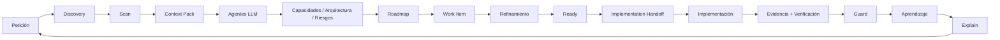

Kaddo madura el conocimiento de un proyecto en cuatro **momentos de operación** — **Base →
Definición → Proyección → Ejecución**. Esta página es el loop práctico; ver
[Momentos de operación](/es/operating-moments/) para los comandos, agentes y resultado esperado de
cada momento.

Kaddo tiene un único loop práctico:

```bash
kaddo init          # estado: new | pre-ai | legacy, tamaño de equipo, estructura
kaddo bootstrap     # proyectos nuevos: base de conocimiento inicial (Business → Product → Tech → Delivery)
kaddo scan          # inventario técnico determinístico → .kaddo/scan.json
kaddo context       # context pack para el LLM → .kaddo/context-pack.md
kaddo add agents    # instala los agent prompt packs
kaddo understand    # plan guiado de handoff CLI → LLM
# ── usa tu LLM con el context pack + agentes para crear
#    capacidades, arquitectura y un roadmap ──
kaddo create --from roadmap   # convierte un candidato del roadmap en un Work Item
kaddo ready WI-001            # marca el Work Item refinado como ready para implementación
kaddo owners suggest          # declara el ownership (code:) en el Work Item
# ── Implementation Handoff → Implementación → Evidencia → Verificación ──
kaddo verify WI-001           # recolectar evidencia, verificar ACs, evaluar completitud
kaddo guard                   # detecta deriva + intersecciones de riesgos legacy
kaddo explain                 # resume lo que Kaddo sabe actualmente
```

En una frase: **escanea el repo → prepara el contexto → usa agentes en tu LLM → crea work
items guiados por el roadmap → refina → ready → implementa con handoff → verifica → guard →
aprende.**

Las ideas nuevas pueden entrar al loop en cualquier punto mediante el
[`backlog-agent`](/es/modules/agents/), que las captura como draft de Work Item o candidato de
roadmap antes del refinamiento — siempre decides tú el siguiente paso.


```mermaid
flowchart LR
    A[Petición] --> B[Discovery]
    B --> C[Scan]
    C --> D[Context Pack]
    D --> E[Agentes LLM]
    E --> F[Capacidades / Arquitectura / Riesgos]
    F --> G[Roadmap]
    G --> H[Work Item]
    H --> I[Refinamiento]
    I --> J[Ready]
    J --> K[Implementation Handoff]
    K --> L[Implementación]
    L --> M[Evidencia + Verificación]
    M --> N[Guard]
    N --> O[Aprendizaje]
    O --> P[Explain]
    P --> A
```

## CLI vs agentes LLM

Kaddo trabaja en dos capas, y el reparto es intencional.

| Capa | Responsabilidad |
|---|---|
| **Kaddo CLI (determinístico)** | inicializar la estructura de conocimiento, escanear señales, generar context packs, instalar prompts de agentes, guiar el handoff, crear work items, declarar ownership, detectar deriva, explicar el estado del proyecto |
| **Chat LLM (interpretación)** | extraer capacidades, reconstruir arquitectura, proponer un roadmap, identificar riesgos, redactar artefactos estructurados |

> El CLI prepara y guarda el contexto. Tu LLM lo interpreta usando los agentes de Kaddo.
> **Kaddo no llama a un LLM por defecto** y nunca requiere una API key.

## Qué hace cada comando

Estos cuatro comandos suelen confundirse — hacen cosas distintas:

| Comando | Qué hace | Actualiza |
|---|---|---|
| `kaddo scan` | Detecta la estructura técnica (stack, carpetas, señales) | `.kaddo/scan.json`, `knowledge/inventory.md` |
| `kaddo context` | Empaqueta el conocimiento existente para tu LLM | `.kaddo/context-pack.md` / `.json` |
| `kaddo understand` | Recomienda el siguiente paso + agente desde el estado real (fase) | `.kaddo/understand.md` |
| `kaddo explain` | Resume lo que Kaddo sabe (por capa) | `.kaddo/explain.md` / `.json` |

## Intención vs realidad

Kaddo mantiene **intención** y **realidad** separadas — responden preguntas distintas:

| Artefacto | Significado |
|---|---|
| `knowledge/tech/codebase.md` | **Intención** — cómo planeamos construirlo |
| `knowledge/tech/current-state.md` | **Realidad** — cómo está construido de verdad (opcional, recomendado) |
| ADR (`knowledge/tech/decisions/`) | **Razón de la decisión** — por qué se decidió |
| `.kaddo/scan.json` | **Señales** — lo que detectó el CLI |

`current-state.md` no reemplaza a `codebase.md`: uno es el plan, el otro la verdad.

## Ciclo de entrega de un Work Item (Build Contract)

Cuando creas un Work Item, Kaddo define un ciclo de entrega repetible — el **Build Contract**
— que mantiene código y conocimiento evolucionando juntos. Los Work Items se mueven
físicamente entre directorios conforme avanzan:

```txt
Intención capturada (draft/) → Refinamiento → Revisión humana → Ready (ready/)
→ Implementation Handoff → Implementación (in-progress/) → Evidencia
→ Verificación → Revisión humana → Completado (completed/) → Aprendizaje
```

| Etapa | CLI / MCP | Qué ocurre |
|---|---|---|
| **Crear** | `kaddo create --from roadmap` | Candidato del roadmap → `work-items/draft/` |
| **Refinar** | skill work-item-refinement | ACs, scope, módulos, refs de riesgos legacy |
| **Ready** | `kaddo ready WI-001` | Humano aprueba → `work-items/ready/` |
| **Handoff** | skill implementation-planning | Ensamblaje de contexto + deliberación de diseño (incluye contexto legacy si está disponible) |
| **Implementar** | implementation-agent | Código + tests en una rama feature |
| **Evidencia** | `kaddo verify WI-001` | Recolectar evidencia de implementación |
| **Verificar** | `kaddo verify WI-001` | Verificar ACs, evaluar completitud |
| **Guard** | `kaddo guard` | Deriva de conocimiento + intersecciones de riesgos legacy |
| **Completar** | — | → `work-items/completed/` |
| **Aprender** | `kaddo learn WI-001` | Capturar aprendizajes, actualizar conocimiento |

**El CLI de Kaddo nunca toca git.** La creación de la rama es parte del protocolo del
*agente que implementa*: el agente **crea una rama primero** para que el trabajo no caiga
en `main`, y **nunca commitea, hace push ni merge sin tu confirmación**.

`kaddo understand` imprime este ciclo cuando hay un Work Item activo.

## Declarar ownership

El ownership se declara en los artefactos y lo confirma un humano:

```txt
kaddo scan → kaddo context → ownership-agent → el humano confirma → kaddo owners suggest → kaddo guard
```

El **ownership-agent** propone globs `code:` precisos; `kaddo owners suggest` es la herramienta
manual / override (normaliza rutas como `src/cli` → `src/cli/**`, las valida y advierte por globs
amplios como `src/**`).

`code:` acepta **múltiples globs**:

```yaml
code:
  - src/tasks/**
  - src/projects/**
  - tests/tasks/**
```

Los agentes (instalados en `knowledge/agents/<capa>/`) proponen los globs a partir de las
señales del scan; tú los confirmas. Luego Guard relaciona los cambios de código con el
artefacto dueño.

## Proyectos nuevos, pre-IA y legacy

Kaddo se adapta al estado de tu proyecto.

| Estado | Qué hace Kaddo |
|---|---|
| **new** | Empieza con una estructura mínima de conocimiento (roadmap, work items, contexto mínimo) sin sobrecarga de proceso. |
| **pre-IA** | Escanea el repo, prepara un context pack y entiéndelo con agentes antes de evolucionar. |
| **legacy** | Mapea el ownership de forma gradual e identifica zonas de riesgo antes de cambiar el código. |

`kaddo init` pregunta el estado del proyecto, el tamaño del equipo y la estructura del
repositorio, y el resto de los comandos adaptan su guía en consecuencia.

## Lo que Kaddo no hace

- **No** es un generador de código.
- **No** es un framework de ejecución de agentes — entrega *prompts* de agentes, no los ejecuta.
- **No** reemplaza a Jira, Linear ni herramientas de documentación.
- **No** es una plataforma.
- **No** llama a un LLM, requiere API key ni infiere la verdad del negocio.
- **No** reemplaza la revisión humana.
