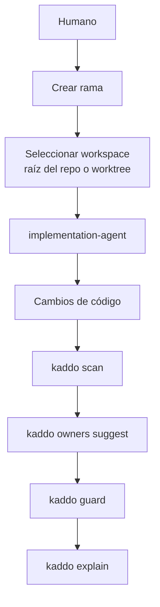

Algunos agentes de IA implementan un Work Item en un **Git worktree** — un directorio de trabajo
separado y enlazado al mismo repositorio — en vez de tu checkout actual. Está bien, pero divide la
realidad: si el agente edita archivos en el worktree mientras tú ejecutas Kaddo en la raíz del
repositorio, `scan`, `guard`, `owners suggest`, `context` y `explain` observan un árbol distinto del
que se está cambiando.

**La regla es simple: ejecuta Kaddo desde el mismo workspace donde se cambia el código.**

## Kaddo es consciente de los worktrees

Kaddo detecta el árbol de trabajo activo desde el filesystem (nunca ejecuta Git) y lo reporta:

- `kaddo explain` → una sección **Workspace** (raíz del repo · Git worktree sí/no · rama activa),
  con una advertencia cuando estás dentro de un worktree.
- `kaddo context` → un bloque **Execution Context**, para que el agente que lee el pack sepa dónde
  está.
- `kaddo understand` → nombra el workspace de implementación actual y te recuerda ejecutar Kaddo
  desde ahí.

```text
## Workspace
- Repository root: /work/app/.worktrees/wi-001
- Git worktree: yes
- Active branch: feature/wi-001-project-foundation
```

## Límites de ejecución de Git

Kaddo nunca muta Git, y los agentes tampoco deberían. Los agentes pueden **sugerir**, pero el
**humano** ejecuta cualquier cosa que cambie el estado de Git.

| Los agentes PUEDEN sugerir | Los agentes NO deben |
|---|---|
| Nombres de rama | Crear o cambiar de rama |
| Mensajes de commit | Crear worktrees |
| Una estrategia / estructura de ramas | Stash, commit, push o merge |

Si se requiere un cambio de rama o de workspace, el agente **se detiene y le pregunta al humano**.
Los prompts del implementation-agent y del work-item-agent declaran estos límites explícitamente.

## Trabajando en la raíz del repositorio

```bash
# Estás en la rama donde ocurre el trabajo.
kaddo scan
kaddo owners suggest
kaddo guard
kaddo explain        # Workspace → Git worktree: no
```

## Trabajando en un Git worktree

```bash
# El agente creó/seleccionó un worktree y edita el código ahí.
cd ../app-worktrees/wi-001          # el directorio del worktree
kaddo scan                           # ejecuta cada comando de Kaddo AQUÍ
kaddo owners suggest
kaddo guard
kaddo explain        # Workspace → Git worktree: yes · branch feature/wi-001-...
```

Ejecutar Kaddo desde el worktree mantiene conocimiento, código y artefactos describiendo la
**misma** realidad.

## El flujo



> Fuera de alcance: Kaddo no crea worktrees ni ramas, no gestiona ramas, ni se integra con
> GitHub/IDEs. Eso sigue siendo acción humana.
