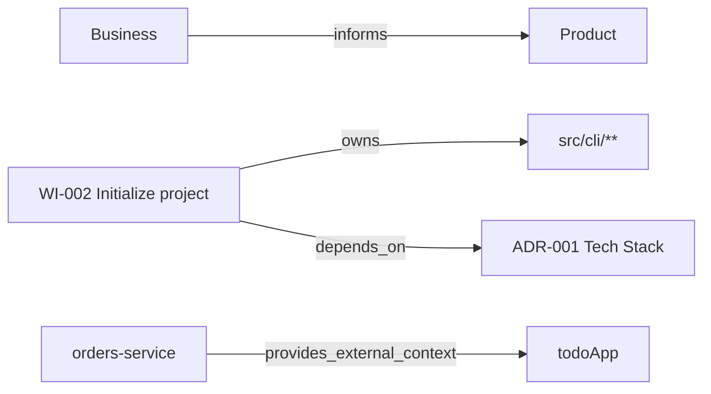

Kaddo already captures connected knowledge — Markdown, front matter, Work Items, ADRs, roadmap,
ownership and Knowledge Capsules. But those connections are usually **implicit**. `kaddo graph
export` makes them explicit as simple, versionable, reviewable files.

```bash
kaddo graph export        # → .kaddo/graph.json + .kaddo/graph.mmd
```

> **You don't need a graph database to start thinking in graphs.** Kaddo exports the graph that
> already exists implicitly in your files — nothing more.

## What it is

A **lightweight, file-based knowledge graph** built deterministically from artifacts you already
have:

```text
Markdown + Front matter + IDs + Globs + Capsules + Roadmap + Work Items
        ↓  kaddo graph export
                graph.json + graph.mmd
        ↓
Onboarding · Impact analysis · Context selection · Guard explanation
```

It helps you answer, fast:

- Which capability connects to this Work Item?
- Which ADR justifies this module?
- Which code paths relate to this change?
- Which external knowledge applies to this integration?
- Which artifacts could go stale if I change this folder?

## What it is **not**

This is not a graph database or a visual platform. Kaddo does **not** read your `src/`, interpret
source code, call an LLM, infer semantic relationships, build a graph database, render a web
portal, use RAG, embeddings or a vector database, or sync in real time. It only exports the
relationships that are already declared in your knowledge.

It is the opposite of RAG: RAG retrieves chunks of text by similarity; this graph exports the
**explicit, declared structure** of your project — no model, no vectors, fully deterministic.

## Outputs

| File | Format | Use it for |
|---|---|---|
| `.kaddo/graph.json` | JSON | tools, tests, debugging, future integrations |
| `.kaddo/graph.mmd` | Mermaid | quick visualization in GitHub, Markdown, docs, slides |

```bash
kaddo graph export --format json      # JSON only
kaddo graph export --format mermaid   # Mermaid only
```

## Scope

```bash
kaddo graph export --scope active   # default — active Work Items + nearby relations
kaddo graph export --scope all      # every supported artifact (can get large)
```

- **active** (default): only active Work Items (`draft`, `ready`, `in-progress`, `blocked`) and
  their directly related nodes (code globs, capabilities, ADRs they depend on, initiative,
  roadmap candidate). The knowledge-layer chain and Knowledge Capsules are always included.
- **all**: the full graph, including completed/archived Work Items and every ADR in
  `knowledge/tech/decisions/` (even unreferenced ones).

`active` is the default to keep diagrams readable.

## Nodes and edges

Nodes come from knowledge artifacts; edges come from front matter and the known knowledge-layer
relationships.

| Edge | From → To | Source |
|---|---|---|
| `informs` | layer → next layer | `business → product → tech → delivery` |
| `owns` | Work Item → code glob | Work Item `code:` |
| `implements` | Work Item → capability | Work Item `capabilities:` |
| `depends_on` | Work Item → ADR | Work Item `decisions:` |
| `governs` | ADR → code glob | ADR `code:` |
| `belongs_to` | Work Item → initiative | `initiative` / `source_initiative` |
| `materialized_as` | roadmap candidate → Work Item | `source: roadmap` + `source_id` |
| `provides_external_context` | Knowledge Capsule → project | `.kaddo/external.yml` |

## How to read the Mermaid

`graph.mmd` is a standard Mermaid `flowchart LR`. GitHub, many Markdown viewers and Docusaurus
render it directly. Paste it into a fenced ```mermaid block, or open it with any Mermaid live
editor.



Each arrow is a declared relationship — follow them to see what depends on what.

## Improving graph quality

Every `kaddo graph export` also evaluates **relationship quality** and writes metadata hints —
non-blocking suggestions that help you connect more of the graph without heavy documentation.

```text
Knowledge graph exported.

Nodes: 21
Edges: 18
Relationship quality: partial

Hints:
- WI-002 has no code ownership, linked capability.
- ADR-001 has no governed code paths.
```

Two extra files are written:

| File | Format | Use it for |
|---|---|---|
| `.kaddo/graph-hints.md` | Markdown | human review — per-artifact missing metadata + suggested front matter |
| `.kaddo/graph-hints.json` | JSON | tooling, tests, the `graph-agent` |

### Quality levels

| Quality | Meaning |
|---|---|
| `good` | Most active artifacts have meaningful relationships. |
| `partial` | Some active artifacts have missing relationship metadata. |
| `sparse` | The graph has many nodes but few meaningful edges. |
| `empty` | The graph has almost no relationships. |

### What the hints detect

- Active Work Items without `code`, `capabilities`, `decisions` or a roadmap `source`.
- ADRs without governed `code` paths.
- Capabilities declared in `capabilities.md` that no Work Item references.
- Knowledge Capsules registered but not referenced by any Work Item (`capsules:`).

The hints are **suggestions, not auto-fixes** — Kaddo never edits your artifacts. Enrich the front
matter yourself, or let the [`graph-agent`](/modules/agents/) propose precise values that you
confirm and apply, then re-run `kaddo graph export`:

```yaml
---
id: WI-002
type: feature
capabilities:
  - task-management
decisions:
  - ADR-001
code:
  - src/cli/**
source: roadmap
source_id: WI-CANDIDATE-001
capsules:
  - orders-service
---
```

```text
kaddo graph export → graph-hints.md → graph-agent → human confirmation
                  → better front matter → better graph
```

## How it improves context

The graph never bloats your context pack. After exporting, `kaddo context` and `kaddo explain`
show a small **summary** (not the full graph):

```text
Knowledge Graph:
- Available: yes
- Nodes: 18
- Edges: 24
- Active Work Items connected to code: 2
```

The full graph stays in the exported files. Kaddo **never generates the graph automatically** —
run `kaddo graph export` when you want it refreshed.

## Security

The graph contains only paths, artifact IDs, labels, owners, summaries and relationships. It must
**never** include secrets, tokens, passwords, private keys, environment values, source code
content or PII — and because Kaddo never reads `src/`, it cannot leak source.

## See also

- [Knowledge Capsules](/knowledge-capsules/) — share knowledge across repositories.
- [Context efficiency](/token-efficiency/) — why structured knowledge beats re-exploration.
- [Operating Moments](/operating-moments/) — where the graph fits in the flow.
