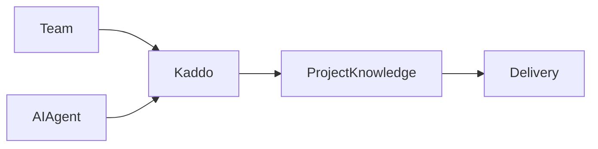

Business, Product and Tech knowledge is written in Markdown. Some knowledge is easier to understand
visually — actors and relationships, business and value flows, product journeys, capability
dependencies, system context, components, integrations and sequences. Kaddo supports **Mermaid**
diagrams for exactly this, without introducing a parallel format.

## One source of truth

A diagram is **knowledge, not a decorative image**. Its source lives inside the Markdown as a
`mermaid` fenced block and is versioned in Git:

````markdown
## Diagrams


````

The same source has two representations, with no duplication:

- **CLI / MCP / repository** → the Mermaid source stays as Markdown (humans read it, LLMs understand
  it, Git diffs it).
- **Admin** → the Mermaid block is rendered as a diagram in the Knowledge detail view.

## Where diagrams fit

- **Business** — actors, business context, value flows, business processes, external participants.
- **Product** — user and product flows, capability relationships, feature interactions, lifecycle,
  `actor → capability → outcome`.
- **Tech** — system context, components, modules, dependencies, integrations, data flows, sequences.
  Useful types: `flowchart`, `sequenceDiagram`, `classDiagram`, `stateDiagram-v2`.

## Grounding rules

Diagrams must be **grounded** in the same knowledge as the surrounding text:

- Add a diagram only when it materially improves understanding.
- Do not add a diagram just because a `Diagrams` section exists in the template.
- Never invent entities or relationships to make a diagram look complete. Text and diagram must
  represent the same known state — if the payment provider is unknown, the diagram must not show
  `Application → Stripe`.

The `business-agent`, `capability-agent` and `architecture-agent` follow these rules during
refinement.

## How the Admin renders

The Admin renders Mermaid inside the normal Knowledge detail view, on top of the existing Markdown
renderer (not a separate page, and not tied to specific filenames — any Knowledge artifact with a
`mermaid` block benefits automatically). Rendering is configured with Mermaid's strict security level,
so diagrams never execute arbitrary scripts.

- **Multiple diagrams** per artifact render independently.
- An **invalid** Mermaid block does not break the page: it shows a local error and falls back to the
  source, while the rest of the Markdown and other valid diagrams keep working.
- Diagrams stay readable in light and dark themes and scroll horizontally if they are wide.

## Storage

The canonical representation is always the Markdown `mermaid` source. Kaddo never stores PNG/SVG
files, screenshots, base64 images or a separate diagram database as the source of truth — rendered
output is derived.

## Existing projects

The feature is backward-compatible. Projects without Mermaid keep working unchanged, with no
migration required. New or refined knowledge can add diagrams whenever they help.
