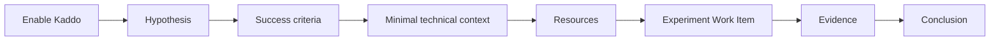

Project mode is separate from project state. State describes the repository (`new`, `pre-ai`, or
`legacy`); mode describes how Kaddo should guide the work.

Use `poc` when the immediate goal is to validate an assumption, not to plan a complete product
roadmap.

```bash
kaddo init --mode poc
# or, for an existing project
kaddo project mode poc
kaddo add agents
kaddo add skills
```

Existing projects remain in `standard` mode when `project.mode` is absent.

## POC route



The canonical artifact is `knowledge/delivery/poc.md`. It records:

- Problem
- Hypothesis
- Expected Value
- Scenario
- Success Criteria
- Constraints
- Non-goals
- Evidence
- Conclusion: `validated`, `rejected`, or `inconclusive`

POC mode is ready after initialization: define the hypothesis and success criteria in `poc.md`,
then create a `spike` when the experiment is clear. It does not require the standard
Business/Product baseline, a roadmap, or a complete capability map. Add technical context and
Project Resources only when the experiment needs them.

Install agents and skills during the initial POC setup. They provide the guided refinement and
implementation context without creating a standard Business/Product baseline.

Run `kaddo understand`, `kaddo context`, or inspect `kaddo://poc` through MCP to see the current
POC status and the next recommended step.

## Graduate or finish

When evidence supports a durable delivery effort, switch back to the standard flow and bootstrap
the remaining baseline:

```bash
kaddo project mode standard
kaddo bootstrap
```

When evidence rejects or cannot establish the hypothesis, record the conclusion in `poc.md` and
keep the decision trace without creating unnecessary product planning artifacts.
