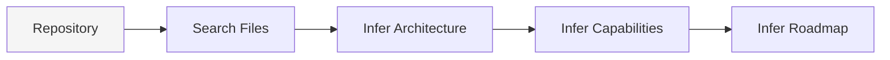
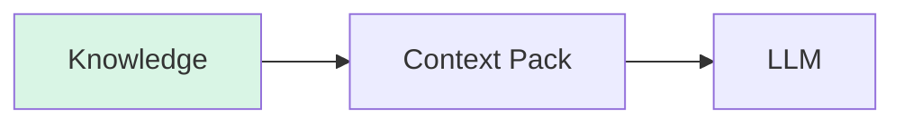
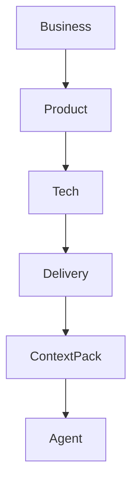
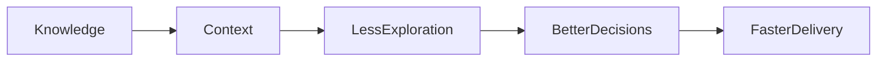

Kaddo's main benefit is not prompt compression or token optimization. Kaddo does not
compress prompts, summarize automatically, remove tokens, or dynamically optimize a context
window.

Kaddo improves **context efficiency** by reducing unnecessary repository exploration:

```text
Knowledge
↓
Context
↓
Less exploration
↓
Better decisions
↓
Token savings as a side effect
```

In one sentence: **Kaddo reduces repository exploration by turning project knowledge into
structured context. Token savings are a consequence, not the goal.**

## The Real Cost of Exploration

The expensive part of many AI-assisted coding sessions is not only the price per token. It is
the cost of discovering project knowledge from scratch:

- Which business problem does this code support?
- Which capabilities already exist?
- Which architectural decisions are still current?
- Which files own a Work Item?
- Which roadmap item is actually active?

Without structure, an agent pays this discovery cost over and over. It reads files, infers
architecture, reconstructs capability boundaries, guesses ownership and asks for more context.
Those extra reads become extra tokens, but the root problem is exploration.

## Repository Exploration Tax

Without Kaddo:



With Kaddo:



The Repository Exploration Tax is the repeated work an agent does just to orient itself before it
can make a useful decision. Kaddo lowers that tax by keeping project knowledge explicit,
structured and close to the code.

## Knowledge Layers

Kaddo organizes knowledge into four layers:



- **Business** explains why the product exists.
- **Product** explains what capabilities and user value matter.
- **Tech** explains how the system is built and why.
- **Delivery** explains how the product evolves through roadmap and Work Items.

These layers exist to reduce exploration. Instead of forcing an agent to rediscover the product
from scattered code, Kaddo gives it a stable map of what is known, what is missing and what work
is active.

## Why Token Savings Happen

Token savings happen because structured context prevents unnecessary reading. They are not the
primary objective.

Kaddo keeps context bounded by design:

- `kaddo context` ships metadata and summaries, not source code.
- Work Items contribute front matter, not full bodies.
- Active Work Items are prioritized over completed and archived history.
- `kaddo explain` can focus by scope, type or date when a full project view is not needed.

That means tokens are spent on interpretation and decisions, not on rediscovering the same
repository shape in every chat.

## Measured Output Size

The following numbers are still useful, but they should be read as evidence of bounded context,
not as a promise that Kaddo directly optimizes tokens.

| Scenario | Work items | Modules | `context` tokens | `explain` tokens | tokens / work item |
|----------|-----------|---------|------------------|------------------|--------------------|
| empty    | 0   | 0  | 619    | 305   | — |
| small    | 5   | 0  | 846    | 399   | 169 |
| medium   | 25  | 2  | 1,909  | 724   | 76 |
| large    | 100 | 5  | 5,545  | 1,870 | 55 |
| xlarge   | 500 | 20 | 25,229 | 8,040 | **50** |

> Tokens ≈ characters ÷ 4 (a rough average for English + Markdown).

The growth is linear because the pack is deterministic and metadata-first. In the `xlarge`
case, the raw knowledge files on disk are about **134,000 tokens**, while the generated context
pack is **25,229**. Source code is never read into the pack.

## Context Efficiency Loop



Kaddo's job is to make project knowledge easier to discover than code. Lower token consumption
is what happens when agents stop wandering through the repository just to learn where they are.
