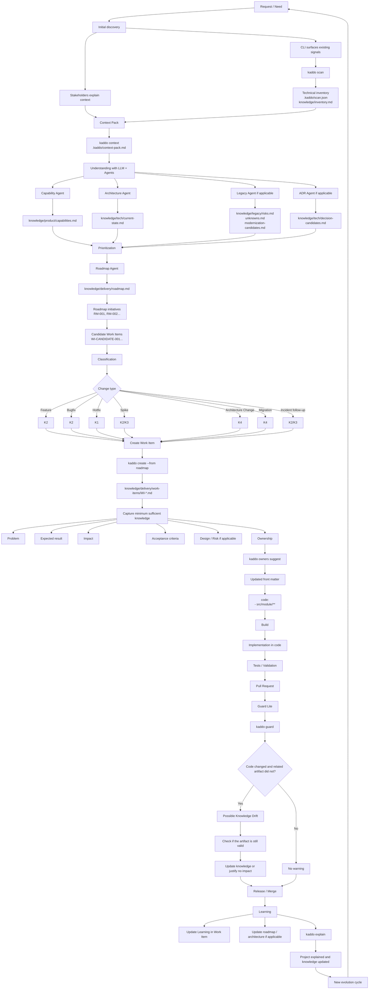

This is the complete Kaddo loop as one narrative. Each step shows the command, what it
contributes, and the artifact it produces.

| # | Step | Command | Produces |
|---|---|---|---|
| 1 | Initialize | `kaddo init` | `.kaddo/config.yml` |
| 2 | Scan | `kaddo scan` | `.kaddo/scan.json`, `knowledge/inventory.md` |
| 3 | Context pack | `kaddo context` | `.kaddo/context-pack.md` |
| 4 | Install agents | `kaddo add agents` | `knowledge/agents/*.md` |
| 5 | Understand | `kaddo understand` | `.kaddo/understand.md` |
| 6 | Understand in LLM | *(your chat)* | `knowledge/product/capabilities.md`, `knowledge/tech/current-state.md`, `knowledge/delivery/roadmap.md` |
| 7 | Create from roadmap | `kaddo create --from roadmap` | `knowledge/delivery/work-items/*.md` |
| 8 | Declare ownership | `kaddo owners suggest` | updated `code:` front matter |
| 9 | Guard | `kaddo guard` | drift FYI on `git diff` |
| 10 | Explain | `kaddo explain` | `.kaddo/explain.md`, `.kaddo/explain.json` |

## The loop in detail



## The commands

```bash
kaddo init
kaddo scan
kaddo context
kaddo add agents
kaddo understand
# ── use your LLM with .kaddo/context-pack.md + the recommended agents to create
#    capabilities, the architecture baseline and the roadmap ──
kaddo create --from roadmap
kaddo owners suggest
kaddo guard
kaddo explain
```

## What happens where

- **Steps 1–5 (CLI):** Kaddo prepares deterministic context — config, technical inventory,
  context pack, agent prompts and a handoff plan. No LLM, no API key.
- **Step 6 (LLM chat):** you run the Kaddo agents in your preferred LLM to turn that context
  into capabilities, architecture and a roadmap. This is where interpretation happens.
- **Steps 7–10 (CLI):** Kaddo turns the roadmap into Work Items, connects them to code via
  ownership, and closes the loop — Guard warns on drift and Explain summarizes the state.

## How the loop closes

`kaddo guard` reads `git diff`, matches changed files against each artifact's `code:` globs,
and shows a **non-blocking FYI** when related knowledge was not updated. `kaddo explain` then
reports what Kaddo knows, what is missing and what to do next — so the next iteration starts
with full context instead of guesswork.

Pick your starting point: [New project](/use-cases/new-project/),
[Pre-AI project](/use-cases/pre-ai-project/) or [Legacy project](/use-cases/legacy-project/).
