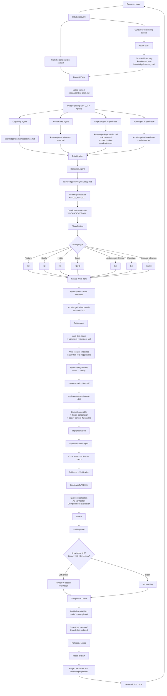

This is the complete Kaddo loop as one narrative. Each step shows the command, what it
contributes, and the artifact it produces.

| # | Step | Command / Skill | Produces |
|---|---|---|---|
| 1 | Initialize | `kaddo init` | `.kaddo/config.yml` |
| 2 | Scan | `kaddo scan` | `.kaddo/scan.json`, `knowledge/inventory.md` |
| 3 | Context pack | `kaddo context` | `.kaddo/context-pack.md` |
| 4 | Install agents | `kaddo add agents` | `knowledge/agents/*.md` |
| 5 | Understand | `kaddo understand` | `.kaddo/understand.md` |
| 6 | Understand in LLM | *(your chat)* | `capabilities.md`, `current-state.md`, `roadmap.md` |
| 7 | Create from roadmap | `kaddo create --from roadmap` | `work-items/draft/WI-001.md` |
| 8 | Refine | work-item-refinement skill | refined WI with ACs, scope, legacy refs |
| 9 | Ready | `kaddo ready WI-001` | `work-items/ready/WI-001.md` |
| 10 | Handoff | implementation-planning skill | Implementation plan + legacy context |
| 11 | Implement | implementation-agent | code + tests |
| 12 | Evidence + Verify | `kaddo verify WI-001` | evidence report, AC verification |
| 13 | Guard | `kaddo guard` | drift FYI + legacy risk intersections |
| 14 | Complete + Learn | `kaddo learn WI-001` | `work-items/completed/WI-001.md` + learnings |
| 15 | Explain | `kaddo explain` | `.kaddo/explain.md`, `.kaddo/explain.json` |

## The loop in detail


```mermaid
flowchart TD
    A[Request / Need] --> B[Initial discovery]

    B --> B1[Stakeholders explain context]
    B --> B2[CLI surfaces existing signals]
    B2 --> B3[kaddo scan]
    B3 --> B4[Technical inventory<br/>.kaddo/scan.json<br/>knowledge/inventory.md]

    B1 --> C[Context Pack]
    B4 --> C
    C --> C1[kaddo context<br/>.kaddo/context-pack.md]

    C1 --> D[Understanding with LLM + Agents]
    D --> D1[Capability Agent]
    D --> D2[Architecture Agent]
    D --> D3[Legacy Agent if applicable]
    D --> D4[ADR Agent if applicable]

    D1 --> E1[knowledge/product/capabilities.md]
    D2 --> E2[knowledge/tech/current-state.md]
    D3 --> E3[knowledge/legacy/risks.md<br/>unknowns.md<br/>modernization-candidates.md]
    D4 --> E4[knowledge/tech/decision-candidates.md]

    E1 --> F[Prioritization]
    E2 --> F
    E3 --> F
    E4 --> F

    F --> F1[Roadmap Agent]
    F1 --> F2[knowledge/delivery/roadmap.md]
    F2 --> F3[Roadmap initiatives<br/>RM-001, RM-002...]
    F3 --> F4[Candidate Work Items<br/>WI-CANDIDATE-001...]

    F4 --> G[Classification]
    G --> G1{Change type}

    G1 -->|Feature| H1[K2]
    G1 -->|Bugfix| H2[K2]
    G1 -->|Hotfix| H3[K1]
    G1 -->|Spike| H4[K2/K3]
    G1 -->|Architecture Change| H5[K4]
    G1 -->|Migration| H6[K4]
    G1 -->|Incident follow-up| H7[K2/K3]

    H1 --> I[Create Work Item]
    H2 --> I
    H3 --> I
    H4 --> I
    H5 --> I
    H6 --> I
    H7 --> I

    I --> I1[kaddo create --from roadmap]
    I1 --> I2[knowledge/delivery/work-items/WI-*.md]

    I2 --> J[Refinement]
    J --> J1[work-item-agent<br/>+ work-item-refinement skill]
    J1 --> J2[ACs · scope · modules<br/>legacy risk refs if applicable]
    J2 --> J3[kaddo ready WI-001<br/>draft/ → ready/]

    J3 --> K[Implementation Handoff]
    K --> K1[implementation-planning skill]
    K1 --> K2[Context assembly<br/>+ design deliberation<br/>+ legacy context if available]

    K2 --> L[Implementation]
    L --> L1[implementation-agent]
    L1 --> L2[Code + tests on feature branch]

    L2 --> M[Evidence + Verification]
    M --> M1[kaddo verify WI-001]
    M1 --> M2[Evidence collection<br/>AC verification<br/>Completeness evaluation]

    M2 --> N[Guard]
    N --> N1[kaddo guard]
    N1 --> N2{Knowledge drift?<br/>Legacy risk intersection?}

    N2 -->|Drift or risk| N3[Review + update knowledge]
    N2 -->|Clean| N4[No warning]

    N3 --> O[Complete + Learn]
    N4 --> O

    O --> O1[kaddo learn WI-001<br/>ready/ → completed/]
    O1 --> O2[Learnings captured<br/>Knowledge updated]

    O2 --> P[Release / Merge]
    P --> P1[kaddo explain]

    P1 --> Q[Project explained and knowledge updated]
    Q --> R[New evolution cycle]
    R --> A
```

## The commands

```bash
kaddo init
kaddo scan
kaddo context
kaddo add agents
kaddo understand
# ── use your LLM with .kaddo/context-pack.md + the recommended agents to create
#    capabilities, the architecture baseline and the roadmap ──
kaddo create --from roadmap
# ── refine with work-item-agent, mark ready ──
kaddo ready WI-001
# ── Implementation Handoff (implementation-planning skill) ──
# ── implement with implementation-agent ──
kaddo verify WI-001
kaddo guard
kaddo learn WI-001
kaddo explain
```

## What happens where

- **Steps 1–5 (CLI):** Kaddo prepares deterministic context — config, technical inventory,
  context pack, agent prompts and a handoff plan. No LLM, no API key.
- **Step 6 (LLM chat):** you run the Kaddo agents in your preferred LLM to turn that context
  into capabilities, architecture and a roadmap. This is where interpretation happens.
- **Steps 7–9 (CLI + LLM):** Kaddo turns the roadmap into Work Items, the work-item-agent
  refines them, and you mark them ready for implementation.
- **Steps 10–14 (CLI + LLM):** The handoff assembles context (including legacy context when
  available), the implementation-agent builds, `kaddo verify` collects evidence and verifies
  ACs, Guard warns on drift and legacy risk intersections, learnings are captured, and
  Explain summarizes the state.

## Who produced what (Agent Trace)

Every Kaddo agent ends its response with an **Agent Trace** so the flow stays auditable — who
produced the result, what it produced and what runs next:

```text
Agent: roadmap-agent
Produced: knowledge/delivery/roadmap.md
Next: kaddo create --from roadmap → work-item-agent

Agent: work-item-agent
Produced: knowledge/delivery/work-items/draft/WI-001.md
Next: kaddo ready → implementation-planning skill → implementation-agent

Agent: implementation-agent
Produced: code · tests
Next: kaddo verify → kaddo guard → kaddo learn → kaddo explain
```

Only the **implementation-agent** may suggest a Git branch (respecting the project Git strategy);
the roadmap-agent and work-item-agent never do. See the
[responsibility matrix](/modules/agents/#responsibility-boundaries--agent-trace).

## How the loop closes

`kaddo guard` reads `git diff`, matches changed files against each artifact's `code:` globs,
and shows a **non-blocking FYI** when related knowledge was not updated. `kaddo explain` then
reports what Kaddo knows, what is missing and what to do next — so the next iteration starts
with full context instead of guesswork.

Pick your starting point: [New project](/use-cases/new-project/),
[Pre-AI project](/use-cases/pre-ai-project/) or [Legacy project](/use-cases/legacy-project/).
