This page is the visual map of Kaddo. It shows the **implemented v2.6+ knowledge loop**:
what the deterministic CLI does, what your LLM agents do, how artifacts connect, and how
Guard, multirepo and governance fit in. Click any diagram to open it full-screen.

> These diagrams describe behavior that exists today. They do **not** imply any future
> automation — see [What the diagrams do not mean](#what-the-diagrams-do-not-mean).

## Knowledge layers (macro flow)

Kaddo frames the whole project as four macro layers under `knowledge/`. Each answers one
question and stays connected to the one above it.

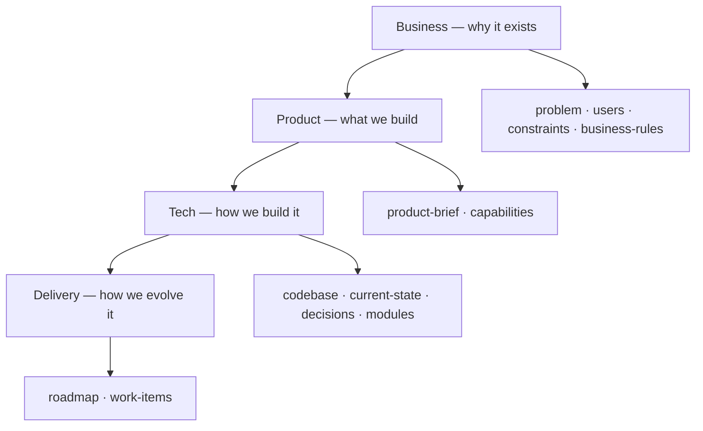

`kaddo bootstrap` seeds the minimal base (Business + Product + `tech/codebase.md`);
Delivery and decisions emerge later through agents and real work.

## Repository Exploration Tax

Without structured knowledge, agents spend part of every session rediscovering the project. With
Kaddo, they can start from a context pack built from explicit knowledge.

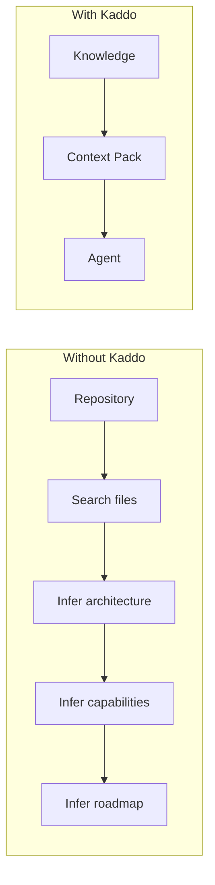

## Knowledge maturity

Kaddo recognizes knowledge by **front-matter type** (not file name) and reports a maturity
per layer. Knowledge grows from consolidated to traceable as the project earns it.

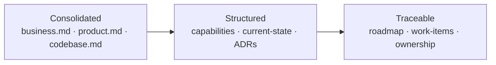

## Kaddo Knowledge Loop

The full loop, from a raw repo to an explained knowledge state. CLI steps are
deterministic; the agent step happens in your own LLM chat.

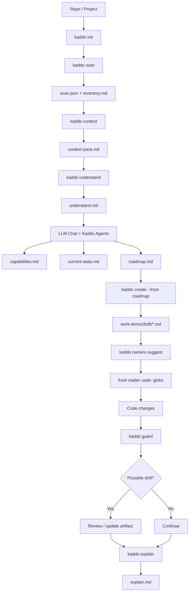

## Agent flow & responsibility boundaries

Each agent produces knowledge and hands off to the next. Only the **implementation-agent** may
suggest a Git branch — and only by respecting the project Git strategy. The roadmap-agent and
work-item-agent never suggest branches or commits.

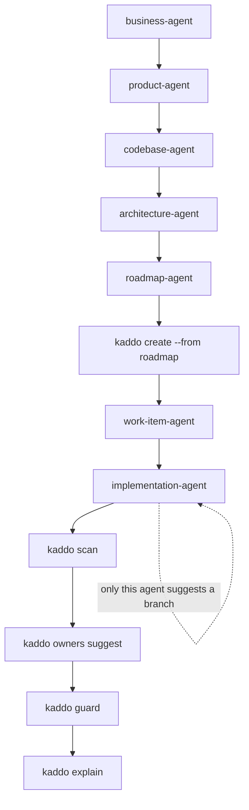

## Unified knowledge discovery

Every command discovers knowledge artifacts through one shared service, so `explain`, `context`,
`understand`, `owners suggest` and `guard` always agree on what exists. Work Items are discovered
recursively across lifecycle subfolders.

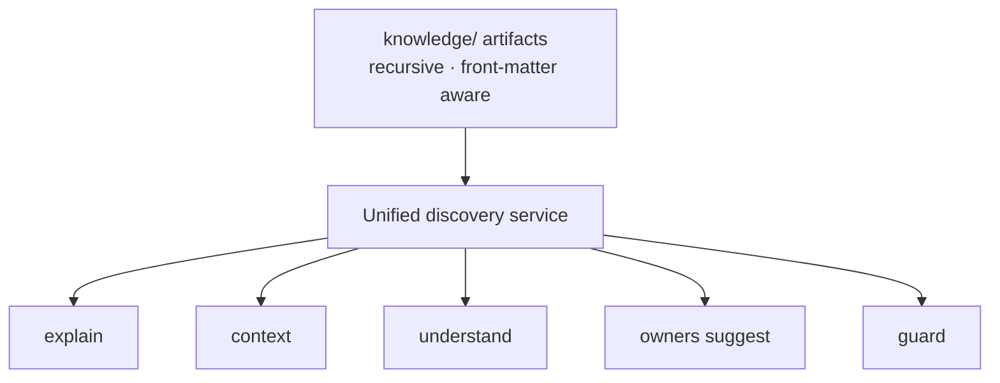

## CLI vs LLM

Kaddo works in two layers. The CLI is deterministic and never calls an LLM; your LLM
chat (with Kaddo agent prompts) does the interpretation. The Knowledge Repository is the
shared ground between them.

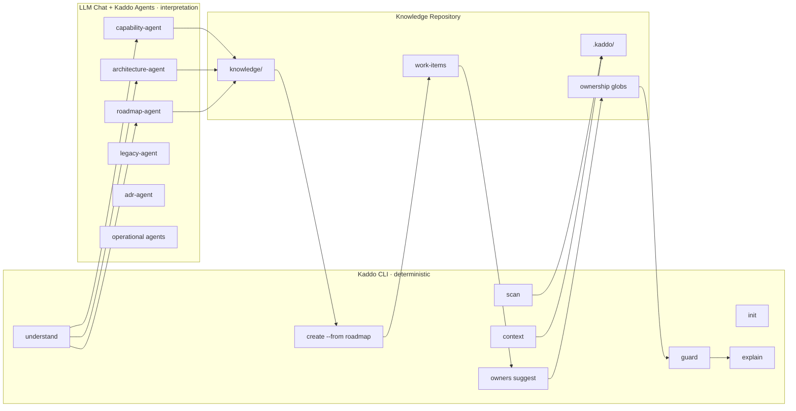

## Human ↔ CLI ↔ LLM

The operational handoff. The human runs every command and saves every reviewed artifact —
Kaddo never calls the LLM for you.

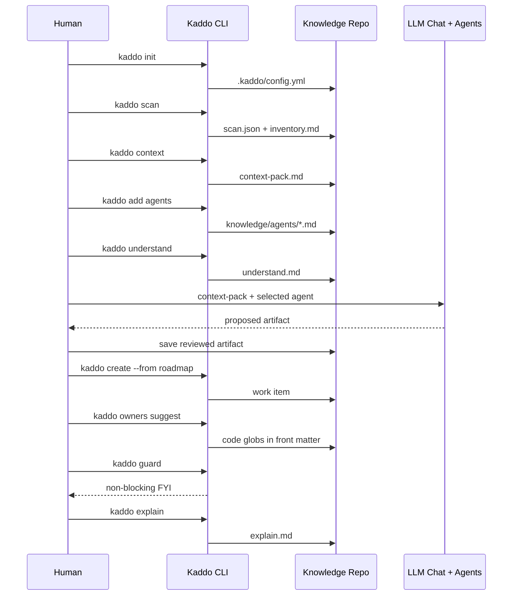

## Artifact graph

How each artifact feeds the next, from `config.yml` to `explain.md`.

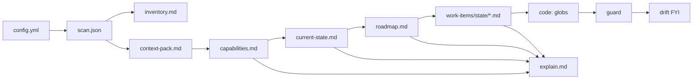

## Project states

`kaddo init` records the project state. The state changes which agents you reach for
first, but the loop and artifacts are the same.

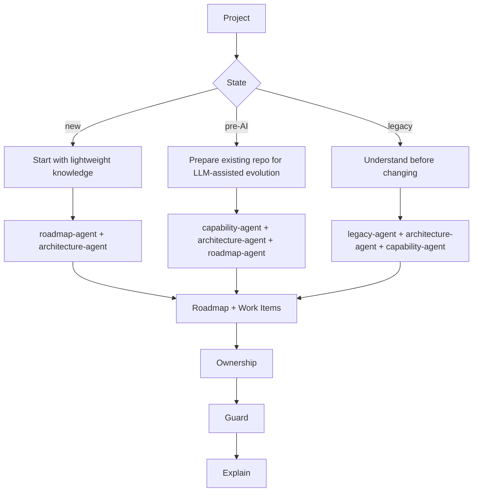

## Multirepo map

From the architecture repo you map secondary repos as modules; each gets its own
knowledge structure. Existing files are never overwritten.

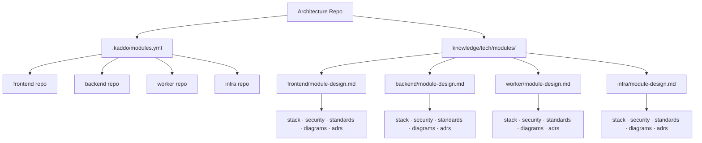

## Ownership flow

Ownership is proposed from scan signals by an agent and **confirmed by a human** before it
is recorded on the artifact. `code:` accepts multiple globs.

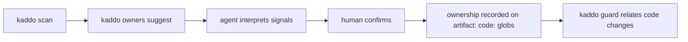

## Roadmap → Candidates → Materialized Work Items

A roadmap lists **candidates**, not Work Items. The roadmap-agent (in your LLM chat) writes the
roadmap in any supported format; the Kaddo CLI parses candidates deterministically; you
materialize them into real Work Items with `kaddo create --from roadmap`. `explain` and
`understand` report the gap (remaining candidates).

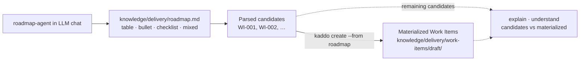

## Work Item lifecycle workspace

Work Items are an active workspace organized by lifecycle state. Phase and initiative remain
front matter metadata; they do not create folders.

Each Work Item has a **type** — `feature`, `bugfix`, `hotfix`, `spike` or `chore` — that flows
through the same lifecycle. `chore` keeps maintenance/tooling/config/infra work from being
mislabeled as a feature.

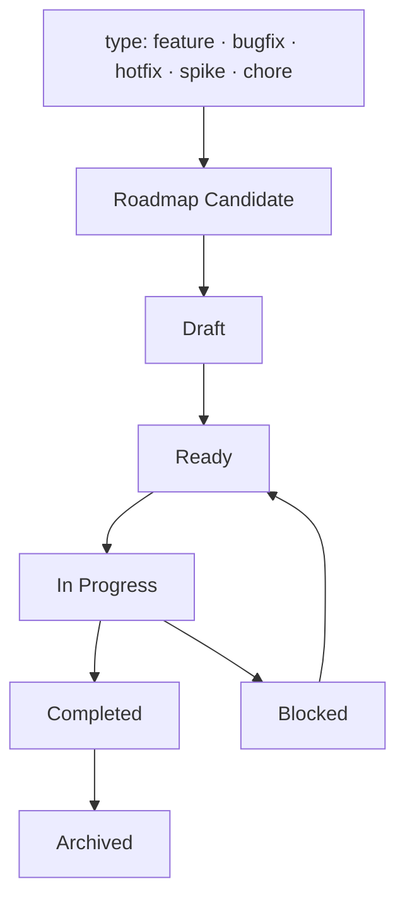

## Work Item delivery lifecycle

From a Work Item to a commit, with knowledge kept in sync. The Kaddo CLI never touches git:
the implementing agent (work-item-agent) creates the branch and commits only with your
confirmation.

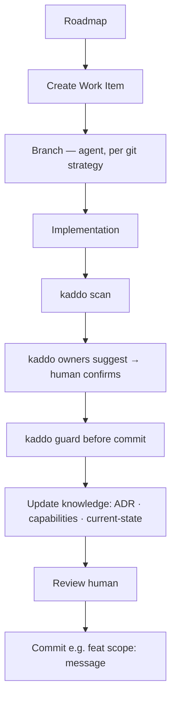

## Guard Lite

Guard reads `git diff`, matches changed files against declared `code:` globs, and emits a
**non-blocking** FYI only when an owning artifact was not updated in the same diff. It is
silent when no artifact declares ownership.

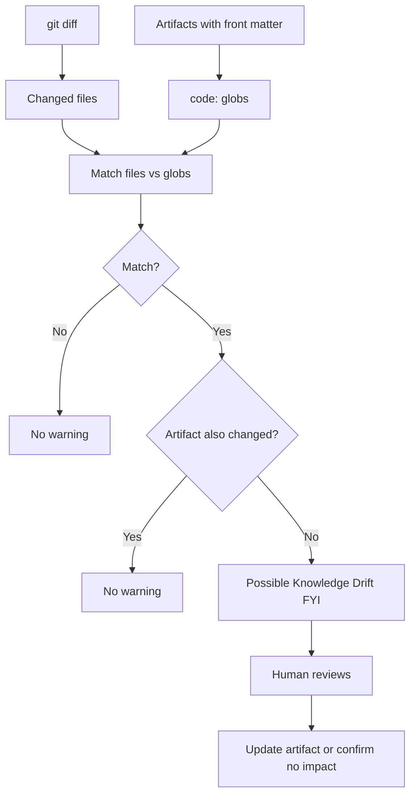

## Governance levels

Governance scales by team size. Kaddo never enforces it — review happens by exception.

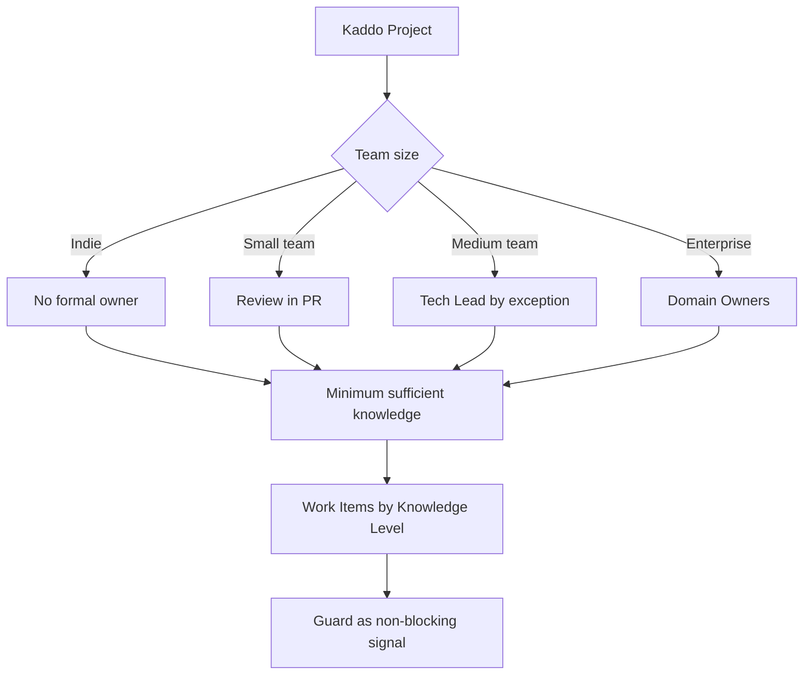

## Kaddo at a glance

A high-level map of commands, agents, artifacts, templates and principles.

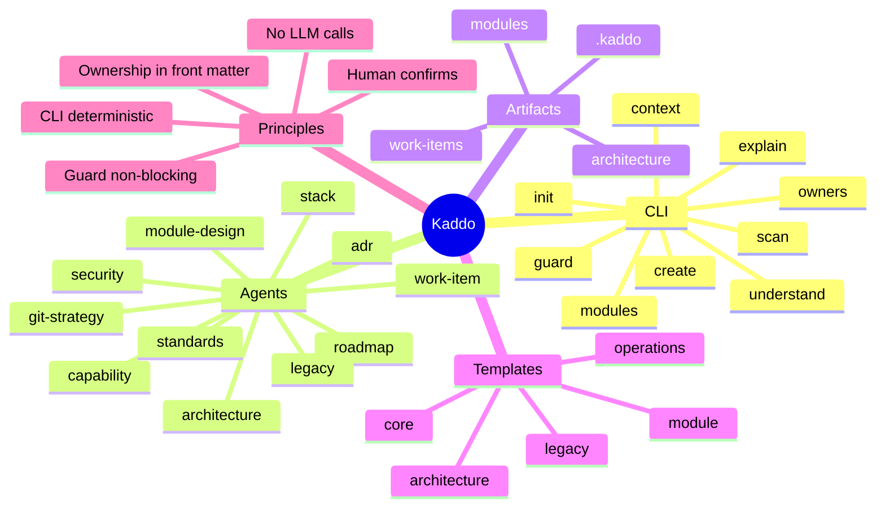

## What the diagrams do not mean

To keep expectations honest, these diagrams do **not** imply that:

- Kaddo calls an LLM — you run agents in your own chat.
- Guard blocks — it is always a non-blocking FYI.
- Ownership is inferred — `code:` globs are declared and human-confirmed.
- Kaddo scans remote repos or calls Git/GitHub APIs.
- Kaddo generates these diagrams automatically — they are authored docs.

---

Next: walk the same loop with real artifacts in the [Examples](/examples/), or read the
step-by-step [Prompt Workflow](/playbook/prompt-workflow/).
