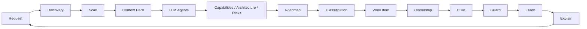

Kaddo has one practical loop:

```bash
kaddo init          # state: new | pre-ai | legacy, team size, structure
kaddo bootstrap     # new projects: initial knowledge base (Business → Product → Tech → Delivery)
kaddo scan          # deterministic technical inventory → .kaddo/scan.json
kaddo context       # LLM context pack → .kaddo/context-pack.md
kaddo add agents    # install agent prompt packs
kaddo understand    # guided CLI → LLM handoff plan
# ── use your LLM with the context pack + agents to create
#    capabilities, architecture and a roadmap ──
kaddo create --from roadmap   # turn a roadmap candidate into a Work Item
kaddo owners suggest          # declare code: ownership on the Work Item
kaddo guard                   # detect possible knowledge drift
kaddo explain                 # summarize what Kaddo currently knows
```

In one sentence: **scan the repo → prepare context → use agents in your LLM → create
roadmap-driven work items → connect knowledge to code → guard against drift → explain the
state.**

New ideas can enter the loop at any point through the
[`backlog-agent`](/modules/agents/), which captures them as a Work Item draft or a roadmap
candidate before refinement — you always decide the next step.



## CLI vs LLM agents

Kaddo works in two layers, and the split is deliberate.

| Layer | Responsibility |
|---|---|
| **Kaddo CLI (deterministic)** | initialize knowledge structure, scan signals, generate context packs, install agent prompts, guide handoff, create work items, declare ownership, detect drift, explain project state |
| **LLM chat (interpretation)** | extract capabilities, reconstruct architecture, propose a roadmap, identify risks, draft structured artifacts |

> The CLI prepares and stores context. Your LLM interprets it using Kaddo agents. **Kaddo
> does not call an LLM by default** and never requires an API key.

## What each command does

These four commands are often confused — they do different things:

| Command | What it does | Updates |
|---|---|---|
| `kaddo scan` | Detect the technical structure (stack, dirs, signals) | `.kaddo/scan.json`, `knowledge/inventory.md` |
| `kaddo context` | Package existing knowledge for your LLM | `.kaddo/context-pack.md` / `.json` |
| `kaddo understand` | Recommend the next step + agent from the real knowledge state (phase) | `.kaddo/understand.md` |
| `kaddo explain` | Summarize what Kaddo currently knows (per layer) | `.kaddo/explain.md` / `.json` |

## Intent vs reality

Kaddo keeps **intent** and **reality** distinct — they answer different questions:

| Artifact | Meaning |
|---|---|
| `knowledge/tech/codebase.md` | **Intent** — how we plan to build it |
| `knowledge/tech/current-state.md` | **Reality** — how it is actually built (optional, recommended) |
| ADR (`knowledge/tech/decisions/`) | **Decision rationale** — why it was decided |
| `.kaddo/scan.json` | **Signals** — what the CLI detected |

`current-state.md` does not replace `codebase.md`: one is the plan, the other the truth.

## Work Item delivery lifecycle

Once you create a Work Item, Kaddo defines a repeatable delivery lifecycle that keeps code
and knowledge evolving together. **The Kaddo CLI never touches git.** Branch creation is
part of the *implementing agent's* protocol (configured in the `work-item-agent` prompt):
the agent **creates a branch first** so work never lands on `main`, and it **never commits,
pushes or merges without your confirmation**.

```txt
Roadmap → Create Work Item → Branch (agent) → Implementation → Scan → Ownership → Guard →
Knowledge update → Review → Commit (with confirmation)
```

1. **Create** — `kaddo create --from roadmap` → `knowledge/delivery/work-items/`.
2. **Branch** — the implementing agent creates a branch from your Git strategy
   (`.kaddo/git.yml`, default `feature/WI-001-<slug>`; also `bugfix/`, `hotfix/`, `spike/`, `chore/`)
   **before** changing code, so nothing lands on the default branch by accident.
3. **Implement** — you or your agent make the change.
4. **Scan** — after new modules/migrations/contracts: `kaddo scan`.
5. **Ownership** — `kaddo owners suggest` (agent proposes `code:` globs, human confirms).
6. **Guard** — **before committing**, run `kaddo guard` to detect knowledge drift.
7. **Knowledge update** — record what changed:
   | Change | Update |
   |---|---|
   | New architecture decision | ADR in `knowledge/tech/decisions/` |
   | New capability | `knowledge/product/capabilities.md` |
   | Significant structural change | `knowledge/tech/current-state.md` (reality) |
8. **Review** — human validation.
9. **Commit** — the agent suggests `feat(tasks): add task reminders` and commits **only with
   your explicit confirmation**; it never pushes or merges on its own.

`kaddo understand` prints this lifecycle whenever a Work Item is active. The branching and
commit rules live in the `work-item-agent` prompt — the Kaddo CLI never runs git.

## Declaring ownership

Ownership is declared on artifacts and confirmed by a human:

```txt
kaddo scan → kaddo owners suggest → agent interprets → human confirms → ownership recorded
```

`code:` accepts **multiple globs**:

```yaml
code:
  - src/tasks/**
  - src/projects/**
  - tests/tasks/**
```

Agents (installed under `knowledge/agents/<layer>/`) propose the globs from scan signals;
you confirm them. Guard then relates code changes to the owning artifact.

## New, pre-AI and legacy projects

Kaddo adapts to where your project is.

| Project state | What Kaddo does |
|---|---|
| **new** | Start with a minimal knowledge structure (roadmap, work items, minimum context) without process overhead. |
| **pre-AI** | Scan the repo, prepare a context pack and understand it with agents before evolving. |
| **legacy** | Map ownership gradually and identify risky areas before changing code. |

`kaddo init` asks for the project state, team size and repository structure, and the rest
of the commands adapt their guidance accordingly.

## What Kaddo does not do

- It is **not** a code generator.
- It is **not** an agent execution framework — it ships agent *prompts*, it does not run them.
- It does **not** replace Jira, Linear or documentation tools.
- It is **not** a platform.
- It does **not** call an LLM, require an API key, or infer business truth.
- It does **not** replace human review.
