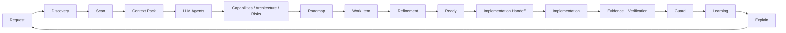

Kaddo matures a project's knowledge through four **operating moments** — **Base → Definition →
Projection → Execution**. This page is the practical loop; see
[Operating Moments](/operating-moments/) for the commands, agents and expected result of each
moment.

Kaddo has one practical loop:

```bash
kaddo init          # state: new | pre-ai | legacy, team size, structure
kaddo bootstrap     # new projects: initial knowledge base (Business → Product → Tech → Delivery)
kaddo scan          # deterministic technical inventory → .kaddo/scan.json
kaddo context       # LLM context pack → .kaddo/context-pack.md
kaddo add agents    # install agent prompt packs
kaddo understand    # guided CLI → LLM handoff plan
# ── use your LLM with the context pack + agents to create
#    capabilities, architecture and a roadmap ──
kaddo create --from roadmap   # turn a roadmap candidate into a Work Item
kaddo ready WI-001            # mark refined Work Item as ready for implementation
kaddo owners suggest          # declare code: ownership on the Work Item
# ── Implementation Handoff → Implementation → Evidence → Verification ──
kaddo verify WI-001           # collect evidence, verify ACs, evaluate completeness
kaddo guard                   # detect knowledge drift + legacy risk intersections
kaddo explain                 # summarize what Kaddo currently knows
```

In one sentence: **scan the repo → prepare context → use agents in your LLM → create
roadmap-driven work items → refine → ready → implement with handoff → verify → guard →
learn.**

New ideas can enter the loop at any point through the
[`backlog-agent`](/modules/agents/), which captures them as a Work Item draft or a roadmap
candidate before refinement — you always decide the next step.


```mermaid
flowchart LR
    A[Request] --> B[Discovery]
    B --> C[Scan]
    C --> D[Context Pack]
    D --> E[LLM Agents]
    E --> F[Capabilities / Architecture / Risks]
    F --> G[Roadmap]
    G --> H[Work Item]
    H --> I[Refinement]
    I --> J[Ready]
    J --> K[Implementation Handoff]
    K --> L[Implementation]
    L --> M[Evidence + Verification]
    M --> N[Guard]
    N --> O[Learning]
    O --> P[Explain]
    P --> A
```

## CLI vs LLM agents

Kaddo works in two layers, and the split is deliberate.

| Layer | Responsibility |
|---|---|
| **Kaddo CLI (deterministic)** | initialize knowledge structure, scan signals, generate context packs, install agent prompts, guide handoff, create work items, declare ownership, detect drift, explain project state |
| **LLM chat (interpretation)** | extract capabilities, reconstruct architecture, propose a roadmap, identify risks, draft structured artifacts |

> The CLI prepares and stores context. Your LLM interprets it using Kaddo agents. **Kaddo
> does not call an LLM by default** and never requires an API key.

## What each command does

These four commands are often confused — they do different things:

| Command | What it does | Updates |
|---|---|---|
| `kaddo scan` | Detect the technical structure (stack, dirs, signals) | `.kaddo/scan.json`, `knowledge/inventory.md` |
| `kaddo context` | Package existing knowledge for your LLM | `.kaddo/context-pack.md` / `.json` |
| `kaddo understand` | Recommend the next step + agent from the real knowledge state (phase) | `.kaddo/understand.md` |
| `kaddo explain` | Summarize what Kaddo currently knows (per layer) | `.kaddo/explain.md` / `.json` |

## Intent vs reality

Kaddo keeps **intent** and **reality** distinct — they answer different questions:

| Artifact | Meaning |
|---|---|
| `knowledge/tech/codebase.md` | **Intent** — how we plan to build it |
| `knowledge/tech/current-state.md` | **Reality** — how it is actually built (optional, recommended) |
| ADR (`knowledge/tech/decisions/`) | **Decision rationale** — why it was decided |
| `.kaddo/scan.json` | **Signals** — what the CLI detected |

`current-state.md` does not replace `codebase.md`: one is the plan, the other the truth.

## Work Item delivery lifecycle (Build Contract)

Once you create a Work Item, Kaddo defines a repeatable delivery lifecycle — the
**Build Contract** — that keeps code and knowledge evolving together. Work Items physically
move between directories as they progress:

```txt
Captured Intent (draft/) → Refinement → Human Review → Ready (ready/)
→ Implementation Handoff → Implementation (in-progress/) → Evidence
→ Verification → Human Review → Completed (completed/) → Learning
```

| Stage | CLI / MCP | What happens |
|---|---|---|
| **Create** | `kaddo create --from roadmap` | Roadmap candidate → `work-items/draft/` |
| **Refine** | work-item-refinement skill | ACs, scope, modules, legacy risk references |
| **Ready** | `kaddo ready WI-001` | Human approves → `work-items/ready/` |
| **Handoff** | implementation-planning skill | Context assembly + design deliberation (includes legacy context when available) |
| **Implement** | implementation-agent | Code + tests on a feature branch |
| **Evidence** | `kaddo verify WI-001` | Collect implementation evidence |
| **Verify** | `kaddo verify WI-001` | Verify ACs, evaluate completeness |
| **Guard** | `kaddo guard` | Knowledge drift + legacy risk intersections |
| **Complete** | — | → `work-items/completed/` |
| **Learn** | `kaddo learn WI-001` | Capture learnings, update knowledge |

**The Kaddo CLI never touches git.** Branch creation is part of the *implementing agent's*
protocol: the agent **creates a branch first** so work never lands on `main`, and it
**never commits, pushes or merges without your confirmation**.

`kaddo understand` prints this lifecycle whenever a Work Item is active.

## Declaring ownership

Ownership is declared on artifacts and confirmed by a human:

```txt
kaddo scan → kaddo context → ownership-agent → human confirms → kaddo owners suggest → kaddo guard
```

The **ownership-agent** proposes precise `code:` globs; `kaddo owners suggest` is the manual /
override tool (it normalizes paths like `src/cli` → `src/cli/**`, validates them and warns on broad
globs like `src/**`).

`code:` accepts **multiple globs**:

```yaml
code:
  - src/tasks/**
  - src/projects/**
  - tests/tasks/**
```

Agents (installed under `knowledge/agents/<layer>/`) propose the globs from scan signals;
you confirm them. Guard then relates code changes to the owning artifact.

## New, pre-AI and legacy projects

Kaddo adapts to where your project is.

| Project state | What Kaddo does |
|---|---|
| **new** | Start with a minimal knowledge structure (roadmap, work items, minimum context) without process overhead. |
| **pre-AI** | Scan the repo, prepare a context pack and understand it with agents before evolving. |
| **legacy** | Map ownership gradually and identify risky areas before changing code. |

`kaddo init` asks for the project state, team size and repository structure, and the rest
of the commands adapt their guidance accordingly.

## What Kaddo does not do

- It is **not** a code generator.
- It is **not** an agent execution framework — it ships agent *prompts*, it does not run them.
- It does **not** replace Jira, Linear or documentation tools.
- It is **not** a platform.
- It does **not** call an LLM, require an API key, or infer business truth.
- It does **not** replace human review.
