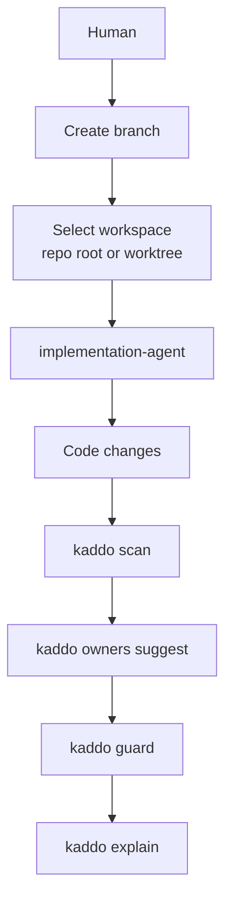

Some AI agents implement a Work Item in a **Git worktree** — a separate working directory linked
to the same repository — instead of your current checkout. That is fine, but it splits reality: if
the agent edits files in the worktree while you run Kaddo in the repository root, `scan`, `guard`,
`owners suggest`, `context` and `explain` observe a different tree than the one being changed.

**The rule is simple: run Kaddo from the same workspace where the code is being changed.**

## Kaddo is worktree-aware

Kaddo detects the active working tree from the filesystem (it never runs Git) and reports it:

- `kaddo explain` → a **Workspace** section (repository root · Git worktree yes/no · active branch),
  with a warning when you are inside a worktree.
- `kaddo context` → an **Execution Context** block, so the agent reading the pack knows where it is.
- `kaddo understand` → names the current implementation workspace and reminds you to run Kaddo from
  it.

```text
## Workspace
- Repository root: /work/app/.worktrees/wi-001
- Git worktree: yes
- Active branch: feature/wi-001-project-foundation
```

## Git execution boundaries

Kaddo never mutates Git, and neither should the agents. Agents may **suggest**, but the **human**
executes anything that changes Git state.

| Agents MAY suggest | Agents must NOT do |
|---|---|
| Branch names | Create or switch branches |
| Commit messages | Create worktrees |
| A Git strategy / branch structure | Stash, commit, push or merge |

If a branch or workspace change is required, the agent **stops and asks the human**. The
implementation-agent and work-item-agent prompts state these boundaries explicitly.

## Working in the repository root

```bash
# You are on the branch where the work happens.
kaddo scan
kaddo owners suggest
kaddo guard
kaddo explain        # Workspace → Git worktree: no
```

## Working in a Git worktree

```bash
# The agent created/selected a worktree and is editing code there.
cd ../app-worktrees/wi-001          # the worktree directory
kaddo scan                           # run every Kaddo command HERE
kaddo owners suggest
kaddo guard
kaddo explain        # Workspace → Git worktree: yes · branch feature/wi-001-...
```

Running Kaddo from the worktree keeps knowledge, code and artifacts describing the **same** reality.

## The flow



> Out of scope: Kaddo does not create worktrees or branches, manage branches, or integrate with
> GitHub/IDEs. Those remain human actions.
