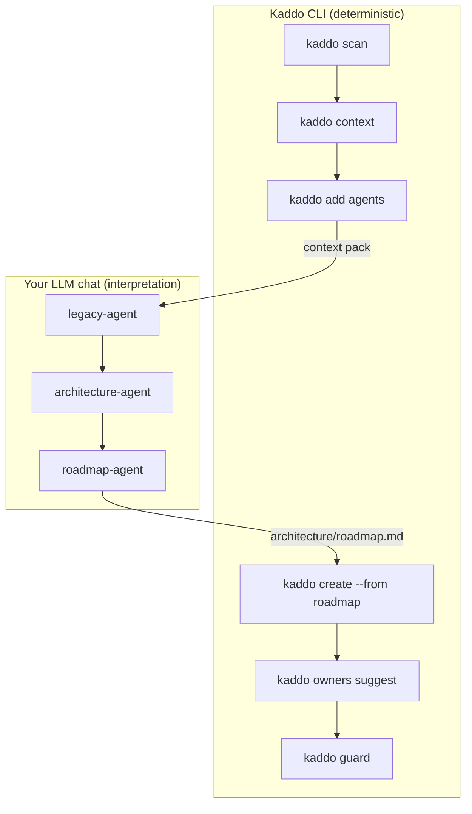

# Prompt Flow — Old Orders (legacy project)

How to operate Kaddo on a fragile legacy system: map the danger **before** touching
code, then make the smallest safe change.

## Goal

Understand risks and unknowns first, propose a safe roadmap, and ship a low-risk first
Work Item without breaking something nobody remembers.

## Workflow diagram



## CLI vs LLM

- **CLI:** `scan`, `context`, `add agents`, `create --from roadmap`, `owners suggest`, `guard`.
- **LLM:** **legacy-agent first** (risks/unknowns), then architecture-agent, then roadmap-agent.
- Why legacy-agent first: you map blast radius and open questions before any change.

## Step-by-step

| Step | CLI command | LLM agent | Input | Output | Save as |
|---|---|---|---|---|---|
| Scan | `kaddo scan` | — | repo files | scan baseline | `.kaddo/scan.json` |
| Context | `kaddo context` | — | config + scan | context pack | `.kaddo/context-pack.md` |
| Risks/unknowns | — | `legacy-agent` | context pack | risks + unknowns | `architecture/legacy/*.md` |
| Architecture | — | `architecture-agent` | context + legacy | current state | `architecture/current-state.md` |
| Roadmap | — | `roadmap-agent` | context + legacy + arch | safe roadmap | `architecture/roadmap.md` |
| Work Item | `kaddo create --from roadmap` | — | roadmap | small Work Item | `architecture/work-items/WI-001-*.md` |
| Ownership | `kaddo owners suggest` | — | Work Item + scan | `code:` globs | updated Work Item |
| Guard | `kaddo guard` | — | git diff + ownership | drift FYI | terminal |

## Prompt handoffs

**Legacy risks & unknowns (do this first):**

```txt
Use the Kaddo context pack with the legacy-agent instructions.
Input:
- .kaddo/context-pack.md
- architecture/agents/legacy-agent.md
Task: Generate architecture/legacy/{risks,unknowns,modernization-candidates}.md.
Constraints: for each risk give blast radius + mitigation; phrase unknowns as questions
with how-to-find-out; do not propose changes yet.
```

**Architecture baseline (after legacy):**

```txt
Use the context pack and legacy artifacts with the architecture-agent instructions.
Input:
- .kaddo/context-pack.md
- architecture/legacy/risks.md
- architecture/legacy/unknowns.md
- architecture/agents/architecture-agent.md
Task: Generate architecture/current-state.md.
Constraints: separate facts from assumptions; carry over the known risks and unknowns.
```

**Safe roadmap:**

```txt
Use the context pack, legacy artifacts and current-state with the roadmap-agent.
Input:
- .kaddo/context-pack.md
- architecture/legacy/risks.md
- architecture/current-state.md
- architecture/agents/roadmap-agent.md
Task: Generate architecture/roadmap.md prioritizing low-risk, observable first steps.
Constraints: respect the legacy risks; prefer additive, reversible changes.
```

## Safe-change guidance

WI-001 adds **append-only** order status logging — it observes before changing and does
not touch totals or invoices (RISK-001, RISK-002). The first change in a legacy system
should be reversible, additive, and answer an open question (here, UNK-001).

## Artifact chain

```txt
.kaddo/scan.json → .kaddo/context-pack.md → architecture/legacy/*.md →
architecture/current-state.md → architecture/roadmap.md → architecture/work-items/WI-001-*.md →
front-matter code: globs → kaddo guard
```

See [`architecture/legacy/`](./architecture/legacy/) (legacy-agent) and
[`sample-agent-outputs/current-state.md`](./sample-agent-outputs/current-state.md)
(architecture-agent) for illustrative outputs.

## Validation checklist

- [ ] Every risk has a blast radius and a mitigation.
- [ ] Every unknown is a question with a "how to find out".
- [ ] The first Work Item is additive/reversible and touches no risky logic.

> Sample LLM outputs in this example are illustrative — produced with Kaddo agent
> prompts in an LLM chat. Kaddo never calls an LLM. Review and adapt before using.
