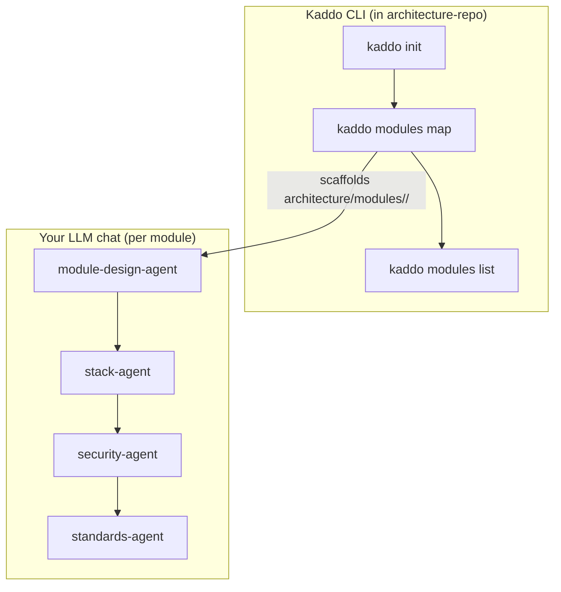

# Prompt Flow — Commerce Stack (multirepo workspace)

How to operate Kaddo across many repositories: map each code repo as a module from the
central architecture repo, then fill in each module's knowledge with agents.

## Goal

Turn four separate repos into one shared knowledge base, with per-module design, stack,
security and standards documented from the architecture repo.

## Workflow diagram



## CLI vs LLM

- **CLI (run in `architecture-repo/`):** `init`, `modules map`, `modules list`.
- **LLM (per module):** module-design-agent, then stack/security/standards agents.
- `kaddo modules map` registers the repo in `.kaddo/modules.yml` and scaffolds the
  module's doc folder; the LLM fills the scaffolds in. Existing files are never overwritten.

## Step-by-step

| Step | CLI command | LLM agent | Input | Output | Save as |
|---|---|---|---|---|---|
| Init | `kaddo init` | — | answers (structure: multirepo) | architecture repo | `.kaddo/config.yml` |
| Map module | `kaddo modules map` | — | name, repo path, type, tech | module entry + scaffolds | `.kaddo/modules.yml` + `architecture/modules/<id>/*` |
| List | `kaddo modules list` | — | descriptor | module table | terminal |
| Module design | — | `module-design-agent` | context pack + module repo | design | `architecture/modules/<id>/module-design.md` |
| Module stack | — | `stack-agent` | module repo | stack | `architecture/modules/<id>/stack.md` |
| Module security | — | `security-agent` | module repo | security notes | `architecture/modules/<id>/security.md` |
| Module standards | — | `standards-agent` | module repo | standards | `architecture/modules/<id>/standards.md` |

## Prompt handoffs

**Module design (per module):**

```txt
Use the Kaddo context pack with the module-design-agent instructions.
Input:
- .kaddo/context-pack.md
- architecture/agents/module-design-agent.md
- the module's repository (e.g. ../frontend)
Task: Fill in architecture/modules/storefront-web/module-design.md.
Constraints: state purpose, boundaries (in/out), inputs/outputs, dependencies on other modules.
```

**Module stack / security / standards:**

```txt
Use the module repo with the stack-agent / security-agent / standards-agent instructions.
Input:
- the module's repository
- architecture/agents/{stack,security,standards}-agent.md
Task: Fill in architecture/modules/<id>/{stack,security,standards}.md.
Constraints: document what is observed; mark unknowns; no security scanning.
```

## Artifact chain

```txt
.kaddo/config.yml (multirepo) → kaddo modules map → .kaddo/modules.yml
  → architecture/modules/<id>/module-design.md
  → architecture/modules/<id>/{stack,security,standards}.md
```

See [`architecture-repo/.kaddo/modules.yml`](./architecture-repo/.kaddo/modules.yml)
and the filled-in
[`architecture-repo/architecture/modules/`](./architecture-repo/architecture/modules/)
designs for illustrative results.

## Validation checklist

- [ ] Each code repo is registered in `.kaddo/modules.yml` with `repoPath` and `type`.
- [ ] Each module-design states clear boundaries and cross-module dependencies.
- [ ] System-wide decisions live in the architecture repo, not inside a single code repo.

> Sample LLM outputs in this example are illustrative — produced with Kaddo agent
> prompts in an LLM chat. Kaddo never calls an LLM. Review and adapt before using.
