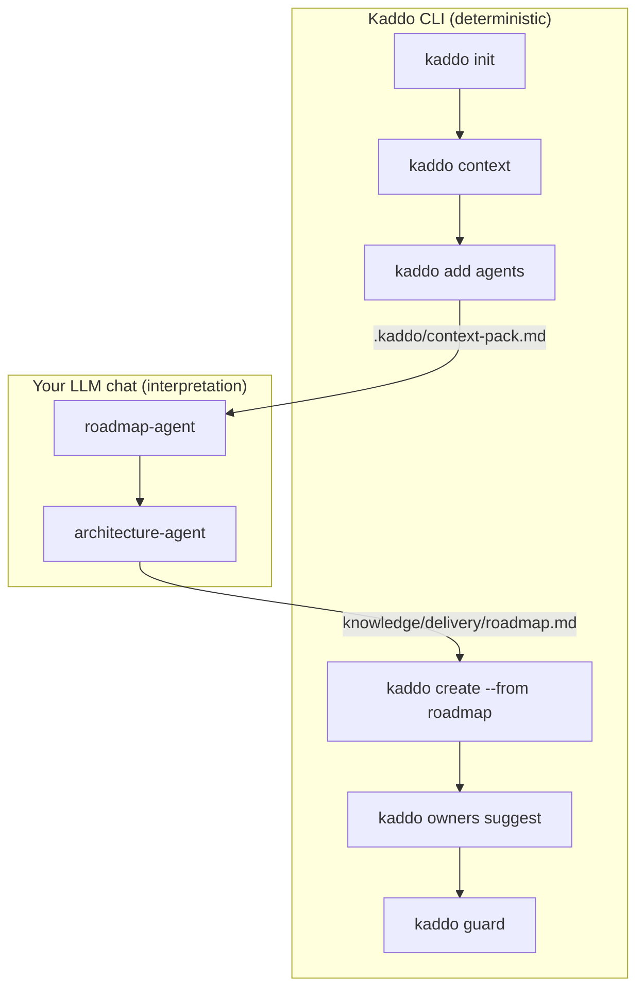

# Prompt Flow — Task Pilot (new project)

How to operate the full Kaddo loop for a greenfield project: which command runs, which
agent prompt to paste into your LLM, what to feed it, and where the output goes.

## Goal

Go from an idea to a structured first Work Item — knowledge first, code second.

## Workflow diagram



## CLI vs LLM

- **CLI:** `init`, `context`, `add agents`, `create --from roadmap`, `owners suggest`, `guard`.
- **LLM:** runs the agent prompts to produce the roadmap and architecture baseline.
- Kaddo never calls an LLM — you paste the prompt + context pack into your own chat.

## Step-by-step

| Step | CLI command | LLM agent | Input | Output | Save as |
|---|---|---|---|---|---|
| Init | `kaddo init` | — | answers | project skeleton | `.kaddo/config.yml` |
| Context | `kaddo context` | — | config | context pack | `.kaddo/context-pack.md` |
| Agents | `kaddo add agents` | — | — | agent prompts | `knowledge/agents/*.md` |
| Roadmap | — | `roadmap-agent` | context pack | roadmap candidates | `knowledge/delivery/roadmap.md` |
| Architecture | — | `architecture-agent` | context + roadmap | baseline | `knowledge/tech/current-state.md` |
| Work Item | `kaddo create --from roadmap` | — | roadmap | Work Item | `knowledge/delivery/work-items/WI-001-*.md` |
| Ownership | `kaddo owners suggest` | — | Work Item | `code:` globs | updated Work Item |
| Guard | `kaddo guard` | — | git diff + ownership | drift FYI | terminal |

## Prompt handoffs

**Roadmap (start here for a new project):**

```txt
Use the Kaddo context pack with the roadmap-agent instructions.
Input:
- .kaddo/context-pack.md
- knowledge/agents/roadmap-agent.md
Task: Generate knowledge/delivery/roadmap.md with candidate initiatives and work items.
Constraints: candidates are suggestions, not decisions; include Knowledge Levels and open questions.
```

**Architecture baseline:**

```txt
Use the Kaddo context pack and roadmap with the architecture-agent instructions.
Input:
- .kaddo/context-pack.md
- knowledge/delivery/roadmap.md
- knowledge/agents/architecture-agent.md
Task: Generate knowledge/tech/current-state.md.
Constraints: separate facts from assumptions; list components, data and risks.
```

## Artifact chain

```txt
.kaddo/config.yml → .kaddo/context-pack.md → knowledge/delivery/roadmap.md →
knowledge/tech/current-state.md → knowledge/delivery/work-items/WI-001-*.md →
front-matter code: globs → kaddo guard
```

See [`sample-agent-outputs/roadmap.md`](./sample-agent-outputs/roadmap.md) for an
illustrative roadmap-agent result.

## Validation checklist

- [ ] `knowledge/delivery/roadmap.md` lists candidate initiatives (`RM-*`) and work items.
- [ ] The first Work Item traces back to a roadmap candidate (`source_id`).
- [ ] The Work Item declares `code:` globs so `kaddo guard` can match it.

> Sample LLM outputs in this example are illustrative — produced with Kaddo agent
> prompts in an LLM chat. Kaddo never calls an LLM. Review and adapt before using.
