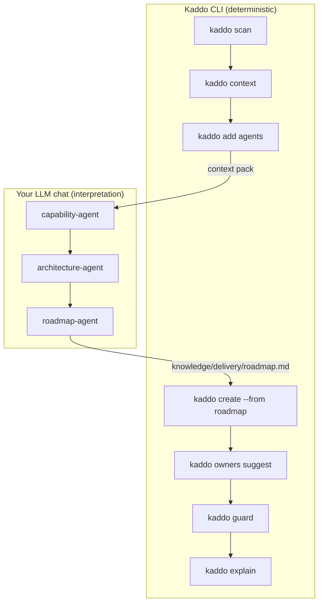

# Prompt Flow — Loyalty Lite (pre-AI project)

How to operate the full Kaddo loop on an existing repo that was not built for
AI-assisted development: scan it, understand it with agents, then act safely.

## Goal

Turn an undocumented existing codebase into structured knowledge, then drive a first
change with Guard watching for drift.

## Workflow diagram



## CLI vs LLM

- **CLI:** `scan`, `context`, `add agents`, `create --from roadmap`, `owners suggest`, `guard`, `explain`.
- **LLM:** capability-agent → architecture-agent → roadmap-agent, in that order.
- The CLI detects technical signals; the LLM infers meaning and marks assumptions.

## Step-by-step

| Step | CLI command | LLM agent | Input | Output | Save as |
|---|---|---|---|---|---|
| Scan | `kaddo scan` | — | repo files | scan baseline | `.kaddo/scan.json` |
| Context | `kaddo context` | — | config + scan | context pack | `.kaddo/context-pack.md` |
| Capabilities | — | `capability-agent` | context pack | capabilities | `knowledge/product/capabilities.md` |
| Architecture | — | `architecture-agent` | context + capabilities | current state | `knowledge/tech/current-state.md` |
| Roadmap | — | `roadmap-agent` | context + caps + arch | roadmap | `knowledge/delivery/roadmap.md` |
| Work Item | `kaddo create --from roadmap` | — | roadmap | Work Item | `knowledge/delivery/work-items/WI-001-*.md` |
| Ownership | `kaddo owners suggest` | — | Work Item + scan | `code:` globs | updated Work Item |
| Guard | `kaddo guard` | — | git diff + ownership | drift FYI | terminal |
| Explain | `kaddo explain` | — | Kaddo artifacts | explanation | `.kaddo/explain.md` |

## Prompt handoffs

**Capabilities:**

```txt
Use the Kaddo context pack with the capability-agent instructions.
Input:
- .kaddo/context-pack.md
- knowledge/agents/capability-agent.md
Task: Generate knowledge/product/capabilities.md.
Constraints: don't invent business facts; mark assumptions; cite code evidence; list open questions.
```

**Architecture:**

```txt
Use the context pack and capabilities with the architecture-agent instructions.
Input:
- .kaddo/context-pack.md
- knowledge/product/capabilities.md
- knowledge/agents/architecture-agent.md
Task: Generate knowledge/tech/current-state.md.
Constraints: separate facts from assumptions; identify modules, dependencies, data stores, risks.
```

**Roadmap:**

```txt
Use the context pack, capabilities and current-state with the roadmap-agent instructions.
Input:
- .kaddo/context-pack.md
- knowledge/product/capabilities.md
- knowledge/tech/current-state.md
- knowledge/agents/roadmap-agent.md
Task: Generate knowledge/delivery/roadmap.md with candidate work items.
Constraints: candidates not decisions; include Knowledge Levels and open questions.
```

## Guard drift demo

After creating WI-001 (`code: sample/src/loyalty/**`), edit `EARN_RATE` in
`sample/src/loyalty/points.ts` **without** updating the Work Item, then run
`kaddo guard`. It prints a non-blocking *Possible knowledge drift* FYI for WI-001 —
the knowledge and the code are now out of sync.

## Artifact chain

```txt
.kaddo/scan.json → .kaddo/context-pack.md → knowledge/product/capabilities.md →
knowledge/tech/current-state.md → knowledge/delivery/roadmap.md → knowledge/delivery/work-items/WI-001-*.md →
front-matter code: globs → kaddo guard → .kaddo/explain.md
```

See the [`sample-agent-outputs/`](./sample-agent-outputs/) folder for illustrative
capability/knowledge/delivery/roadmap results.

## Validation checklist

- [ ] Each capability in `capabilities.md` cites evidence or is flagged as an assumption.
- [ ] `current-state.md` separates facts from assumptions.
- [ ] Editing owned code without updating WI-001 triggers a Guard FYI.

> Sample LLM outputs in this example are illustrative — produced with Kaddo agent
> prompts in an LLM chat. Kaddo never calls an LLM. Review and adapt before using.
